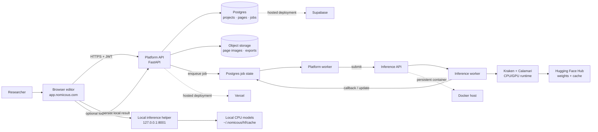
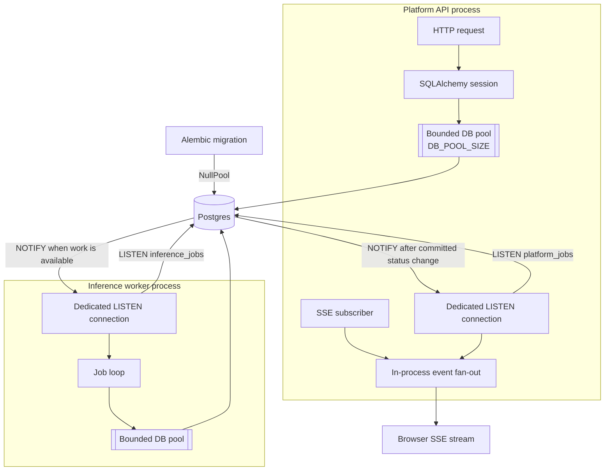

# Nomicous — HTR for Historical Manuscripts

Nomicous (formerly **greekOCR / Kalamos**) combines handwriting-text-recognition
(HTR) models with a manuscript editor. It is built for researchers working with
Greek, Syriac, Coptic, Armenian, and related historical scripts.

[](https://nomicous.com)
[](https://app.nomicous.com)
[](https://huggingface.co/kkkamur07/greek-htr-calamari)
[](https://huggingface.co/kkkamur07/syriac-htr-calamari)
[](https://github.com/kkkamur07/greekOCR)

**Links:** [Project website](https://nomicous.com) ·
[Application](https://app.nomicous.com) ·
[Repository](https://github.com/kkkamur07/greekOCR)

## 1. Platform overview

Nomicous turns manuscript page images into editable transcriptions:

1. **Segment** pages into blocks and text lines with Kraken.
2. **Transcribe** line images with script-specific Calamari models.
3. **Review and correct** model output in a browser-based editor.
4. **Annotate, export, and publish** the resulting manuscript data and PDFs.

The repository contains both the research and production systems:

- **Models and training:** Calamari and Kraken training, fine-tuning, evaluation,
  dataset preparation, and notebooks under [`src/`](src/), [`configs/`](configs/),
  and [`experiments/`](experiments/).
- **Inference:** a standalone FastAPI service under [`inference/`](inference/)
  with synchronous and asynchronous segment/transcribe APIs.
- **Platform:** the Nomicous editor, API, Postgres models, authentication,
  annotation workflows, exports, and background jobs under [`nomicous/`](nomicous/).

### Models

| Capability | Model | Link |
|---|---|---|
| Greek line transcription | `greek-calamari-v1` | [Greek HTR model on Hugging Face](https://huggingface.co/kkkamur07/greek-htr-calamari) |
| Syriac line transcription | `syriac-calamari-v1` | [Syriac HTR model on Hugging Face](https://huggingface.co/kkkamur07/syriac-htr-calamari) |
| Page segmentation | `greek-kraken-segment-v1` | Kraken's packaged BLLA model |

The model catalog is versioned in [`inference/registry.yaml`](inference/registry.yaml).
Greek and Syriac checkpoints are currently published; the same registry and
training pipeline are designed to add Coptic, Armenian, and other script-specific
models as labelled data becomes available.

## 2. Faster manuscript research

If you practise HTR on Greek, Syriac, Coptic, or Armenian manuscripts, Nomicous
is intended to make the repetitive first transcription pass **up to 10× faster**.
That means less time retyping lines and more time for critical editing, collation,
and interpretation—ultimately helping you publish your research sooner.

The system is designed around an expert-in-the-loop workflow: models provide a
strong draft, while the researcher remains in control of segmentation,
transcription, correction, annotation, and publication. Your corrections can also
be exported as training data for better models on your own material.

For an example of the current Greek recognition work, the Calamari experiment
achieved 1.69% CER on one held-out line in the evaluation notebook:
[`experiments/calamari.ipyn_greek.ipynb`](experiments/calamari.ipyn_greek.ipynb).
Treat this as an experiment result, not a universal accuracy guarantee—performance
depends on script, hand, image quality, layout, and training data.

## 3. Install and get started

### Option A: run the complete stack with Docker

Prerequisites: [Docker Desktop](https://docs.docker.com/desktop/), Git, and
about 10 GB of disk space for images and model caches.

```bash
git clone https://github.com/kkkamur07/greekOCR.git
cd greekOCR

cp .env.compose.example .env
cp nomicous/backend/core/.env.example nomicous/backend/core/.env
docker compose up --build
```

Open the editor at [http://localhost:5173](http://localhost:5173). The local
services are:

| Service | Address |
|---|---|
| Editor | `http://localhost:5173` |
| Platform API | `http://localhost:8000` |
| API documentation | `http://localhost:8000/docs` |
| Inference API | `http://localhost:8010` |
| Postgres | `127.0.0.1:5433` |

Run detached, inspect logs, and stop the stack with:

```bash
docker compose up --build -d
docker compose logs -f
docker compose down
```

The first inference request downloads the selected public Hugging Face weights
into the mounted cache. See [`inference/README.md`](inference/README.md) for
model resolution, registry, and API details.

### Option B: run services individually

Prerequisites: Python 3.11–3.12, [uv](https://docs.astral.sh/uv/), Node.js 20+,
and Docker for the local Postgres database.

Install the Python environments from the repository root:

```bash
uv sync --group platform --group inference
docker compose up db -d
```

Start the inference API:

```bash
PYTHONPATH=. uv run --group inference \
  uvicorn inference.api.main:app --host 0.0.0.0 --port 8001 --reload
```

Start the platform API in a second terminal:

```bash
cd nomicous
export PYTHONPATH=.
uv run --project ../ --group platform \
  alembic -c infrastructure/alembic.ini upgrade head
uv run --project ../ --group platform \
  uvicorn backend.core.app:create_app --factory --reload --port 8000
```

Start the frontend in a third terminal:

```bash
cd nomicous/frontend
npm install
cp .env.local.example .env.local
npm run dev
```

For training and fine-tuning rather than serving, install the relevant groups
and follow the training configs:

```bash
uv sync --extra kraken --extra train
# Calamari: src/train/calamari/
# Kraken:   src/model/kraken/finetuning.py
```

### Install the local inference helper

The helper lets the hosted application use a researcher's local CPU for
segmentation and transcription. Download a release installer when available,
or build one from this repository:

```bash
# macOS
bash packaging/helper/macos/build-dmg.sh

# Linux
bash packaging/helper/linux/build-tarball.sh

# Windows PowerShell
powershell packaging/helper/windows/build-installer.ps1
```

The generated artifacts are in `packaging/helper/dist/`. Each installer
registers the helper to start automatically and creates the model cache at
`~/.nomicous/hf/cache/`. After installation, verify it with:

```bash
curl http://127.0.0.1:8001/health
curl http://127.0.0.1:8001/inference/v1/catalog
```

### Helper release downloads

Download the native helper installers from the
[latest GitHub release](https://github.com/kkkamur07/greekOCR/releases/latest).
The current `inference-helper-v0.1.3` release is distributed as follows
(compressed download sizes; future builds may vary slightly):

| Platform | Release asset | Approx. size |
|---|---|---:|
| macOS | [`nomicous-inference-helper-macos.dmg`](https://github.com/kkkamur07/greekOCR/releases/download/inference-helper-v0.1.3/nomicous-inference-helper-macos.dmg) | 311.6 MiB |
| Windows | [`nomicous-inference-helper-windows.zip`](https://github.com/kkkamur07/greekOCR/releases/download/inference-helper-v0.1.3/nomicous-inference-helper-windows.zip) | 301.8 MiB |
| Linux | [`nomicous-inference-helper-linux.tar.gz`](https://github.com/kkkamur07/greekOCR/releases/download/inference-helper-v0.1.3/nomicous-inference-helper-linux.tar.gz) | 432.2 MiB |

These bundles are large because they include the CPU PyTorch, Kraken, and
Calamari runtime so the helper works without a separate Python installation.
The helper currently uses `huggingface_hub` for revision-aware model downloads.
Because the published model repositories are public, a later packaging pass can
trim the bundle by replacing that dependency with a small `wget`-based
downloader, while preserving pinned revisions, artifact hashes, and cache
layout.

For a source checkout or helper development:

```bash
HELPER_REGISTRY_URL=https://api.nomicous.com/inference/v1/registry \
HF_CACHE_ROOT=~/.nomicous/hf/cache \
uv run --group inference python -m inference.helper
```

See [`packaging/helper/README.md`](packaging/helper/README.md) for signing,
auto-start, platform-specific installation, and troubleshooting.

## 4. Technical decisions and architecture

### The system at a glance

The platform separates the browser editor, application API, machine-learning
execution, and persistence. This keeps the user-facing API responsive while
long-running inference jobs run in processes that are allowed to stay alive.



There are therefore two inference paths:

- **Cloud path:** the browser creates a job, a persistent worker dispatches it,
  and the inference worker writes the result back through the job callback.
- **Local path:** the browser calls the loopback helper directly, then submits
  the result to the platform API. The cloud path remains available as a fallback.

### Local inference helper

The hosted browser cannot execute Python or PyTorch on a researcher's computer,
and a hosted API cannot call that computer's `localhost`. The helper solves this
without moving the whole application onto every researcher's machine:

```text
Browser ── HTTPS ──► Nomicous API ──► Postgres
   │
   └── 127.0.0.1:8001 ──► Local Inference Helper ──► CPU models
```

The browser orchestrates local inference and sends the result back through the
authenticated API. This keeps projects, permissions, media, and annotations in
one place while allowing sensitive or expensive manuscript images to remain on
the researcher's machine during inference.

The helper is deliberately small: it exposes health, catalog, and run endpoints;
it has no Postgres connection, job queue, or platform business logic. It binds
to `127.0.0.1` by default, downloads model weights on first use, and synchronizes
the model registry so adding a model does not require reinstalling the helper.
Cloud inference remains available as a fallback when the helper is unavailable
or a model is marked `host_eligibility: remote`.

### Jobs, connection pooling, and notifications

Jobs are durable rows rather than messages that exist only in memory. The
platform and inference services use bounded SQLAlchemy connection pools for
ordinary database work. The default pool size is five connections per process,
with pre-ping and recycling to avoid stale connections after idle periods.
Production operators can tune this with `DB_POOL_SIZE` and `DB_POOL_RECYCLE`.

The notification listener is intentionally separate from the ordinary pool:
it keeps a dedicated PostgreSQL connection open for `LISTEN/NOTIFY`, while
request handlers and workers borrow short-lived connections from their pools.
This prevents an idle SSE or notification listener from consuming a normal
request slot. Alembic migrations use `NullPool` because migrations are
short-lived administrative commands, not application traffic.



The notification path is a wake-up mechanism, not the source of truth. A
status update is committed to Postgres first; `NOTIFY` then wakes listeners,
which read or fan out the current state. If a listener disconnects, the browser
reconnects and the frontend can fall back to polling `GET /jobs/{job_id}`.

On Supabase, use the connection mode recommended for the workload: direct or
session-pooled connections for long-lived listeners, and transaction pooling
for short-lived request traffic when appropriate. See the
[Supabase deployment notes](docs/deployment/supabase.md) for pooler and
`asyncpg` configuration.

### Separated API and worker execution

Inference is CPU/GPU-intensive and can take much longer than an HTTP request.
The inference API therefore handles validation and job submission while a
separate worker loads models and performs segmentation/transcription. They can
restart and scale independently, and workers can later move to GPU hosts without
changing the HTTP contract.

### SSE with polling fallback

Jobs are persisted in Postgres, so the UI can recover from refreshes and
reconnects. In Docker deployments, workers publish committed status changes
through Postgres `NOTIFY`; the API streams them through
`GET /jobs/{job_id}/events` using Server-Sent Events. The frontend falls back to
`GET /jobs/{job_id}` polling when SSE is unavailable, including on serverless
deployments.

SSE avoids repeatedly authenticating and querying unchanged rows during long
jobs, while polling keeps the product functional on infrastructure that cannot
hold a long-lived database listener.

### Other important choices

- **Hugging Face Hub for weights:** registry entries use `hf://` sources, pinned
  revisions and artifact hashes where available. Weights are cached locally
  rather than baked into every image or installer.
- **CPU-first local inference:** the helper ships only the runtime needed for
  Calamari and Kraken, excluding training stacks and GPU/CUDA builds to keep
  installation practical for researchers.
- **Postgres as the job and domain store:** projects, documents, annotations,
  transcriptions, and job state share one transactional model. Alembic is the
  schema source of truth for both local Docker Postgres and hosted Supabase.
- **Serverless where it fits, persistent workers where it does not:** Vercel
  serves the landing page, SPA, and request/response API; long-running PyTorch
  inference and job workers run in Docker.
- **Typed boundaries:** Pydantic contracts define segment, transcribe, job, and
  callback payloads, while the frontend consumes generated OpenAPI types.
- **Expert review rather than blind automation:** model output is a transcription
  layer that can be compared, corrected, copied into ground truth, exported, and
  used for future fine-tuning.

### Hosted API load testing

The hosted platform API has a read-heavy Locust suite covering health, public
document viewing, authenticated project and document reads, page-editor
hydration, media, model lookup, and job status. It does not upload documents or
mutate production data. See [`tests/load/README.md`](tests/load/README.md) for
the full scenario and environment-variable reference.

To open the Locust dashboard:

```bash
source tests/load/get-token.sh
uv run --group load-testing locust -f tests/load/locustfile.py
```

Open `http://127.0.0.1:8089`, set the API host and load-test parameters, then
start with low concurrency. Provide `LOCUST_PROJECT_ID`,
`LOCUST_DOCUMENT_ID`, `LOCUST_PART_ID`, and optionally `LOCUST_JOB_ID` to
exercise the fixture-backed routes. Credentials belong in the ignored
`tests/load/.env` file; do not commit tokens or passwords.

Latest public smoke result (2026-07-10):

| Setting | Result |
|---|---:|
| Host | `https://api.nomicous.com` |
| Users / spawn rate | 2 / 1 user per second |
| Duration | 30 seconds |
| Requests / failures | 10 / 0 |
| Overall median / maximum | 100 ms / 834 ms |
| Health median | 100 ms |
| Public registry median | 96 ms |
| Public document median | 72 ms |
| Public layout median | 160 ms |
| Public media median | 830 ms |

This was a low-volume public-path smoke test. Authenticated project,
document, page-editor, model, and job-status paths require a valid dedicated
load-test JWT and were not included in these results.

Latest dashboard run (2026-07-10):

| Setting | Result |
|---|---:|
| Users / spawn rate | 50 / 2 users per second |
| Requests / failures | 953 / 0 |
| Throughput | 9.06 requests per second |
| Overall average / median | 85.5 ms / 59 ms |
| Overall p95 / p99 | 160 ms / 420 ms |
| Overall maximum | 1,271 ms |
| `GET /health` p95 / p99 | 150 ms / 530 ms |
| `GET /me` p95 / p99 | 200 ms / 590 ms |
| `GET /projects` p95 / p99 | 160 ms / 210 ms |
| `GET /inference/models` p95 / p99 | 150 ms / 460 ms |

This run exercised the authenticated core API reads and completed with zero
failures. Document, page-editor, media, and job-status results require the
fixture IDs to be present in the Locust process environment.

### Production topology

| Surface | Deployment |
|---|---|
| [nomicous.com](https://nomicous.com) | Vercel landing site |
| [app.nomicous.com](https://app.nomicous.com) | Hosted manuscript editor |
| `api.nomicous.com` | FastAPI platform API |
| `inference.nomicous.com` | Docker inference API and worker |
| Database and image storage | Supabase Postgres and Storage |

More operational detail is in [`docs/deployment/production.md`](docs/deployment/production.md)
and [`docs/deployment/supabase.md`](docs/deployment/supabase.md).

## Repository map and further reading

```text
src/                 Training, fine-tuning, and data preparation
inference/            Inference API, worker, registry, and local helper
nomicous/              Platform API, editor, jobs, and domain model
packaging/helper/      Native helper builds and installers
docs/                  Deployment, testing, architecture, and decisions
```

- [Inference service documentation](inference/README.md)
- [Nomicous platform documentation](nomicous/README.md)
- [Helper packaging documentation](packaging/helper/README.md)
- [Deployment guide](docs/deployment/production.md)
- [Hugging Face publishing and model registry guide](scripts/hf/README.md)
- [Project documentation index](docs/README.md)
- [Launch readiness audit](docs/codebase-audit.md)
- [Repository hygiene](docs/repository-hygiene.md)
- [Cleanup plan](docs/repository-cleanup-plan.md)
