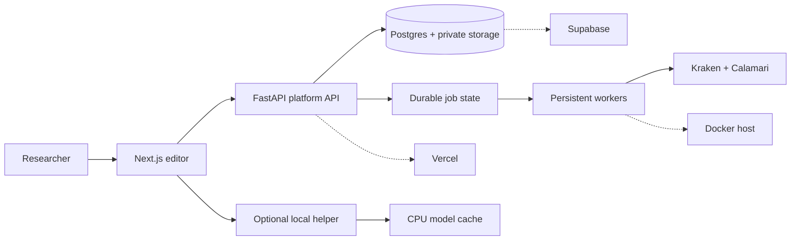

# Nomicous

Nomicous is an open-source platform for transcribing, annotating, sharing, and
publishing historical manuscripts. It is being developed for the Nomos
research ecosystem, with a focus on Syriac, Coptic, Armenian, Byzantine Greek,
and related scripts.

Nomicous combines a browser manuscript editor, model-assisted segmentation and
handwritten-text recognition (HTR), collaboration, publication, and a
training-data workflow in one platform.

**Links:** [Website](https://nomicous.com) ·
[Application](https://app.nomicous.com) ·
[Hugging Face](https://huggingface.co/kkkamur07) ·
[GitHub](https://github.com/kkkamur07/greekOCR) ·
[Documentation index](docs/README.md)

## What it does

Nomicous turns manuscript page images into editable, reviewable research data:

1. Upload or open a manuscript page.
2. Segment the page into written lines.
3. Generate a model transcription when a compatible HTR model is available.
4. Correct the model output and pair text with segments.
5. Review, share, publish, and export the result.

The system is expert-in-the-loop by design. Models draft; researchers decide
what is correct. Approved work can produce processed line images and
transcription files for publication or future model training.

## Why use it?

Nomicous is for researchers, universities, libraries, and projects that need
more control than a closed transcription service provides. The platform is
open source and can be adapted to your own institution, data policy, language,
annotation conventions, and infrastructure.

You can:

- run supported inference on a researcher’s own computer through the native helper;
- keep application data behind an API you control;
- collaborate through projects and document sharing;
- correct model output instead of treating it as automatic ground truth;
- export research and training data in a predictable format; and
- extend the model registry and workflow to new historical scripts.

The project aims to make the first transcription pass up to 10× faster. Its
open-source design gives researchers an alternative to closed-source platforms
with control over data, hosting, model choice, and review.

## Current model support

The runtime catalog currently ships:

| Capability                      | Model                                                                                         | Status                                |
| ------------------------------- | --------------------------------------------------------------------------------------------- | ------------------------------------- |
| Page segmentation               | Kraken BLLA (`blla-segment`)                                                                | Available                             |
| Syriac line transcription       | [Calamari model](https://huggingface.co/kkkamur07/syriac-htr-calamari) (`syriac-calamari-v1`) | Available                             |
| Greek, Coptic, and Armenian HTR | Language-specific models                                                                      | Expansion work; not all are published |

The repository includes data preparation, training, and publishing tools for
expanding this catalog. A model is runtime-supported only after its weights are
published, pinned, verified, and added to
[inference/registry.yaml](inference/registry.yaml).

The project has an experimental result of 1.69% character error rate on one
held-out Greek line. This is not a platform-wide accuracy guarantee: results
depend on the script, hand, image quality, layout, and training data.

## Run it locally with Docker

The fastest way to evaluate the complete application is the development
Compose stack. It is not a hardened internet-facing production deployment.

Prerequisites: Git, Docker Desktop with Compose, and about 10 GB of free disk
space.

```bash
git clone https://github.com/kkkamur07/greekOCR.git
cd greekOCR
cp .env.compose.example .env
```

Replace the placeholder values in `.env` for:
`POSTGRES_PASSWORD`, `JWT_SECRET`, `INFERENCE_WEBHOOK_SECRET`, and
`INFERENCE_SERVICE_SECRET`. Then start the stack:

```bash
docker compose up --build
```

Open [http://localhost:5173](http://localhost:5173). Development seed credentials are
`dev@example.com` / `dev-pass-123`.

| Service               | Address                                                  |
| --------------------- | -------------------------------------------------------- |
| Editor                | [http://localhost:5173](http://localhost:5173)           |
| Platform API          | [http://localhost:8000](http://localhost:8000)           |
| API docs              | [http://localhost:8000/docs](http://localhost:8000/docs) |
| Compose inference API | [http://localhost:8010](http://localhost:8010)           |
| Postgres              | `127.0.0.1:5433`                                         |

The first inference request downloads public weights into `src/hf/cache`.
Host port `8001` is reserved for the optional local inference helper; the
Compose inference container listens on `8001` internally and is exposed as
`8010` on the host.

```bash
docker compose ps
curl -s http://localhost:8000/health | python -m json.tool
docker compose logs -f
docker compose down
```

## Self-hosting and local inference

The complete local stack is available for development and evaluation. A production deployment currently requires manual configuration of Supabase, three Vercel projects, DNS, secrets, migrations, and if remote inference is enabled, a persistent Docker host for the workers. It is not currently a one-click full-stack hosting product.

The native inference helper is the one-click part: it runs Kraken and Calamari
on a researcher’s machine, caches weights under
`~/.nomicous/hf/cache`, and lets the hosted browser persist results through the
platform API.

Start a source helper with:

```bash
HELPER_REGISTRY_URL=http://localhost:8000/inference/v1/registry \
HF_CACHE_ROOT=~/.nomicous/hf/cache \
uv run --group inference python -m inference.helper
```

Then verify:

```bash
curl -s http://127.0.0.1:8001/health
curl -s http://127.0.0.1:8001/inference/v1/catalog
```

## Architecture in one picture



The browser never connects directly to Postgres or private Storage. The API
owns authentication, authorization, project sharing, document state, and job
state. Postgres `NOTIFY` wakes API listeners, which deliver job changes through
SSE when a long-lived listener is available; the frontend falls back to polling
when it is not. There is no email or push notification provider in the current
implementation.

## Read next

- [Use and host Nomicous](docs/guides/using-and-hosting.md)
- [Models and datasets](docs/inference/models-and-datasets.md)
- [Technical architecture](docs/architecture.md)
- [Inference service reference](inference/README.md)
- [Helper packaging](packaging/helper/README.md)
- [Model publishing workflow](scripts/hf/README.md)
- [Testing guide](docs/guides/testing.md)
- [Production deployment](docs/deployment/production.md)
- [Security notes](docs/security/)
