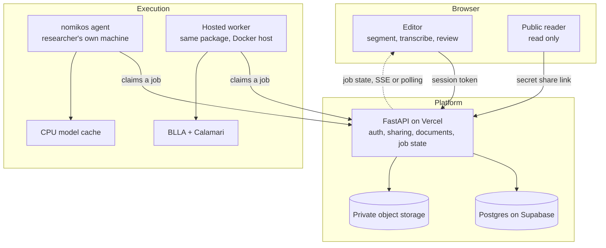

# Nomikos

Nomikos is an open-source platform for transcribing, annotating, sharing, and publishing
historical manuscripts. It is being developed for the Nomos research ecosystem, with a focus
on Syriac, Coptic, Armenian, Byzantine Greek, and related scripts.

It combines a browser manuscript editor, model-assisted segmentation and handwritten-text
recognition (HTR), collaboration, publication, and a training-data workflow in one platform.

Links: [Website](https://nomikos.app) ·
[Application](https://app.nomikos.app) ·
[Hugging Face](https://huggingface.co/kkkamur07) ·
[GitHub](https://github.com/kkkamur07/greekOCR) ·
[Documentation index](docs/README.md)

## What it does

Nomikos turns manuscript page images into editable, reviewable research data:

1. Upload or open a manuscript page.
2. Segment the page into written lines.
3. Generate a model transcription when a compatible HTR model is available.
4. Correct the model output and pair text with segments.
5. Review, share, publish, and export the result.

The system is expert-in-the-loop by design. Models draft, and researchers decide what is
correct. Approved work can produce processed line images and transcription files for
publication or future model training.

## Why use it?

Nomikos is for researchers, universities, libraries, and projects that need more control than
a closed transcription service provides. The platform is open source and can be adapted to
your own institution, data policy, language, annotation conventions, and infrastructure.

You can:

- run supported inference on a researcher's own computer through the `nomikos` agent;
- keep application data behind an API you control;
- collaborate through projects and document sharing;
- correct model output instead of treating it as automatic ground truth;
- export research and training data in a predictable format; and
- extend the model registry and workflow to new historical scripts.

The project aims to make the first transcription pass up to 10x faster. Being open source also
gives researchers an alternative to closed platforms, with control over data, hosting, model
choice, and review.

## Current model support

The runtime catalog currently ships:

| Capability                      | Model                                                                                         | Status                                |
| ------------------------------- | --------------------------------------------------------------------------------------------- | ------------------------------------- |
| Page segmentation               | Kraken BLLA (`blla-segment`)                                                                  | Available                             |
| Syriac line transcription       | [Calamari model](https://huggingface.co/kkkamur07/syriac-htr-calamari) (`syriac-calamari-v1`) | Available                             |
| Greek, Coptic, and Armenian HTR | Language-specific models                                                                      | Expansion work; not all are published |

The repository includes data preparation, training, and publishing tools for expanding this
catalog. A model is runtime-supported only after its weights are published, pinned, verified,
and added to [inference/registry.yaml](inference/registry.yaml).

The project has an experimental result of 1.69% character error rate on one held-out Greek
line. That is not a platform-wide accuracy guarantee: results depend on the script, the hand,
image quality, layout, and training data.

## Run it locally with Docker

The fastest way to evaluate the complete application is the development Compose stack. It is
not a hardened internet-facing production deployment.

Prerequisites: Git, Docker Desktop with Compose, and about 10 GB of free disk space.

```bash
git clone https://github.com/kkkamur07/greekOCR.git
cd greekOCR
cp infrastructure/.env.compose.example infrastructure/.env
```

Replace the placeholder values in `infrastructure/.env` for `POSTGRES_PASSWORD`, `JWT_SECRET`, and
`INFERENCE_WEBHOOK_SECRET`. Then start the stack:

```bash
docker compose -f infrastructure/docker-compose.yml up --build
```

Open [http://localhost:5173](http://localhost:5173). Development seed credentials are
`dev@example.com` / `dev-pass-123`.

| Service      | Address                                                  |
| ------------ | -------------------------------------------------------- |
| Editor       | [http://localhost:5173](http://localhost:5173)           |
| Platform API | [http://localhost:8000](http://localhost:8000)           |
| API docs     | [http://localhost:8000/docs](http://localhost:8000/docs) |
| Postgres     | `127.0.0.1:5433`                                         |

The first inference request downloads public weights into `~/.nomikos/hf/cache`.

```bash
docker compose -f infrastructure/docker-compose.yml ps
curl -s http://localhost:8000/health | python -m json.tool
docker compose -f infrastructure/docker-compose.yml logs -f
docker compose -f infrastructure/docker-compose.yml down
```

## Self-hosting and local inference

The complete local stack is available for development and evaluation. A production deployment
currently requires manual configuration of Supabase, three Vercel projects, DNS, secrets, and
migrations, plus a persistent Docker host for the workers if remote inference is enabled. It
is not a one-click full-stack hosting product today.

Local inference is a command-line agent rather than a background service (ADR 0002). It is the
one published package, `nomikos-inference`, and a hosted worker installs that same package.
It runs BLLA and Calamari on the researcher's CPU and caches weights under
`~/.nomikos/hf/cache`.

```bash
uv tool install nomikos-inference   # or: pip install nomikos-inference
nomikos pair          # links this machine to your account
nomikos run           # takes pages from the queue until you stop it
```

It opens no port. The agent asks the platform for work, downloads the one page image it was
handed through a short-lived signed link, runs the model, and reports the result back. Nothing
on the researcher's machine has to be reachable from a browser, a proxy, or a VPN. Point it at
a different platform with `NOMIKOS_API_URL` or `--api-url`.

Where a job runs is decided once, when it is submitted, from the account setting "use my
computer when it is available" and whether that computer has been seen recently. Every job
then says which host ran it. An agent that is not running is an ordinary announced state
rather than a failure: the work goes to the cloud, and the page says so.

## Architecture in one picture


```mermaid
flowchart TB
    subgraph browser["Browser"]
        Editor["Editor<br/>segment, transcribe, review"]
        Reader["Public reader<br/>read only"]
    end

    subgraph platform["Platform"]
        API["FastAPI on Vercel<br/>auth, sharing, documents, job state"]
        DB[("Postgres on Supabase")]
        Blobs[("Private object storage")]
    end

    subgraph execution["Execution"]
        Agent["nomikos agent<br/>researcher's own machine"]
        Worker["Hosted worker<br/>same package, Docker host"]
        LocalModels["CPU model cache"]
        Models["BLLA + Calamari"]
    end

    Editor -->|"session token"| API
    Reader -->|"secret share link"| API
    API --> DB
    API --> Blobs
    Agent -->|"claims a job"| API
    Worker -->|"claims a job"| API
    Agent --> LocalModels
    Worker --> Models
    API -.->|"job state, SSE or polling"| Editor
```

Nothing outside the platform box reaches Postgres or private storage. The API owns
authentication, authorization, project sharing, document state and job state, and it is the
only thing that reads a page image off disk. The public reader is the same API seen through a
narrower door: it carries no session, and every route it can reach demands the document's
secret share token or answers exactly as if the document did not exist.

Where a job runs is decided once, at submission. Both execution hosts run the same package
and claim work from the same durable job state, so a job that starts in the cloud and a job
that starts on a laptop differ only in which host is recorded against it.

Postgres `NOTIFY` wakes API listeners, which deliver job changes through SSE when a
long-lived listener is available; the frontend falls back to polling when it is not. There is
no email or push notification provider in the current implementation.

## Read next

- [Use and host Nomikos](docs/guides/using-and-hosting.md)
- [Models and datasets](docs/inference/models-and-datasets.md)
- [Technical architecture](docs/architecture.md)
- [Inference service reference](inference/README.md)
- [Model publishing workflow](scripts/hf/README.md)
- [Testing guide](docs/guides/testing.md)
- [Production deployment](docs/deployment/production.md)
- [Security notes](docs/security/)
