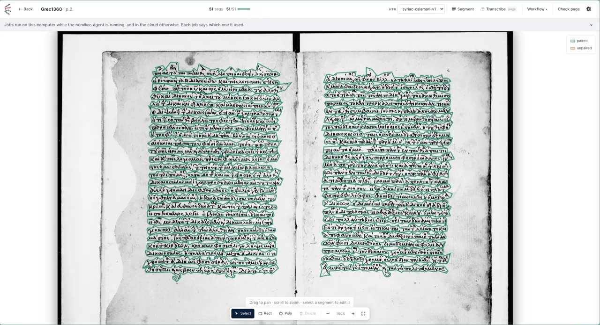

<div align="center">
  <h1>Nomikos</h1>
  <p><strong>Nomikos is an open-source platform for transcribing historical manuscripts you can run in minutes.</strong></p>
  
  <p><em>In this view, Nomikos pairs line segments with an editable transcription. Models draft the first pass from the page image — researchers correct, review, share, publish, and export.</em></p>
  <p>
    <a href="#quick-start"><strong>Quick Start</strong></a> ·
    <a href="#current-model-support"><strong>Models</strong></a> ·
    <a href="docs/README.md"><strong>Documentation</strong></a> ·
    <a href="https://huggingface.co/nomikos-project"><strong>Hugging Face</strong></a> ·
    <a href="#explore-nomikos"><strong>Explore</strong></a> ·
    <a href="https://nomikos.app"><strong>Website</strong></a>
  </p>

  <a href="https://nomikos.app"></a>
  <a href="https://app.nomikos.app"></a>
  <a href="https://huggingface.co/nomikos-project"></a>
</div>

Upload a manuscript page and Nomikos segments it into written lines, drafts a transcription where a compatible HTR model is available, and hands you a browser editor to correct, review, share, publish, and export. From there, adapt the workflow to your institution, data policy, language, and annotation conventions.

Nomikos handles the editor, API, storage, job state, streaming, and local-or-hosted inference needed to turn page images into reviewable research data within boundaries you control.

## Built for Research

Nomikos is being developed for the Nomos research ecosystem, with a focus on Syriac, Coptic, Armenian, Byzantine Greek, and related scripts.

The system is expert-in-the-loop by design. Models draft, and researchers decide what is correct. Approved work produces processed line images and transcription files for publication or future model training.

The project has an experimental result of 1.69% character error rate on one held-out Greek line. That is not a platform-wide accuracy guarantee: results depend on the script, the hand, image quality, layout, and training data.

## Quick Start

The fastest way to evaluate the complete application is the development Compose stack. It is not a hardened internet-facing production deployment.

Prerequisites: Git, Docker Desktop with Compose, and about 10 GB of free disk space.

```bash
git clone https://github.com/kkkamur07/greekOCR.git
cd greekOCR
cp infrastructure/.env.compose.example infrastructure/.env
```

Replace the placeholder values in `infrastructure/.env` for `POSTGRES_PASSWORD`, `JWT_SECRET`, and `INFERENCE_WEBHOOK_SECRET`. Then start the stack:

```bash
docker compose -f infrastructure/docker-compose.yml up --build
```

Open the editor:

```bash
open http://localhost:5173   # or visit manually
# Development seed login: dev@example.com / dev-pass-123
```

| Service      | Address                                        |
| ------------ | ---------------------------------------------- |
| Editor       | [http://localhost:5173](http://localhost:5173) |
| Platform API | [http://localhost:8000](http://localhost:8000) |
| API docs     | [http://localhost:8000/docs](http://localhost:8000/docs) |
| Postgres     | `127.0.0.1:5433`                               |

The first inference request downloads public weights into `~/.nomikos/hf/cache`.

```bash
docker compose -f infrastructure/docker-compose.yml ps
curl -s http://localhost:8000/health | python -m json.tool
docker compose -f infrastructure/docker-compose.yml logs -f
docker compose -f infrastructure/docker-compose.yml down
```

## Why Nomikos

- **Keep the expert in the loop.** Models draft segments and transcriptions; researchers correct and approve. Model output is never treated as automatic ground truth.
- **Operate inside your own data boundary.** Keep application data behind an API you control, with your own hosting, data policy, and review conventions.
- **Run inference on your own computer.** Point the `nomikos` agent at the platform and run supported BLLA and Calamari models on a researcher's CPU — no inbound ports, VPN, or proxy required.
- **Collaborate through projects and sharing.** Organize work in projects, share documents, and publish through secret-link public reading with no session at all.
- **Aim for a 10x faster first pass.** Correcting a model draft beats transcribing from blank, with exports in a predictable format for research or retraining.

## Complete Workflow

- **Turn pages into editable data.** Upload or open a page, segment it into lines, generate a model transcription, and pair text with segments.
- **Correct instead of retyping.** Edit the draft in the browser editor, with job state that says which host ran each job and what is still queued.
- **Review, share, and publish.** Move documents through review, share them with collaborators, and publish read-only views for readers.
- **Export training-ready data.** Produce processed line images and transcription files from approved work for publication or future model training.
- **Extend to new scripts.** Add models through the registry, weights, and publishing workflow — data preparation, training, and Hub publishing tools are in the repo.

## Data Control and Review

Data controls define the boundary around Nomikos:

- Runs in infrastructure you control, including local Docker evaluation today and manual Supabase + Vercel + worker setup for production.
- Nothing outside the platform reaches Postgres or private storage. The API owns authentication, authorization, project sharing, and document and job state, and it is the only thing that reads a page image off disk.
- The public reader is the same API seen through a narrower door: no session, and every route it can reach demands the document's secret share token or answers exactly as if the document did not exist.
- The local agent opens no port. It claims one page over a short-lived signed link, runs the model, and reports back. An agent that is not running is an announced state, not a failure: work goes to the cloud, and the page says so.
- Job updates travel over Postgres `NOTIFY` to API listeners, then SSE with polling fallback. There is no email or push provider in the current implementation.

See [`docs/security/`](docs/security/), [`docs/architecture.md`](docs/architecture.md), and [`docs/database-design.md`](docs/database-design.md), including auth boundaries, share-link behavior, and rate limiting.

## Current Model Support

Through the pinned runtime registry, Nomikos pages can use:

| Capability | What Nomikos does |
| --- | --- |
| Page segmentation | Segments pages into written lines with Kraken BLLA (`blla-segment`) |
| Syriac transcription | Transcribes Syriac lines with the [Calamari model](https://huggingface.co/nomikos-project/syriac-htr-calamari) (`syriac-calamari-v1`) |
| Greek, Coptic, and Armenian HTR | Drafts transcriptions with language-specific models — expansion work, not all published |

A model is runtime-supported only after its weights are published, pinned, verified, and added to [nomikos_inference/registry.yaml](nomikos_inference/registry.yaml). The repo includes data preparation, training, and publishing tools for expanding this catalog.

Run supported inference locally:

```bash
uv tool install nomikos-inference   # or: pip install nomikos-inference
nomikos pair          # links this machine to your account
nomikos run           # takes pages from the queue until you stop it
```

Point it at a different platform with `NOMIKOS_API_URL` or `--api-url`.

## Ways to Run Nomikos

- **As a browser editor.** Open pages, correct segments and text, and move work through review at `http://localhost:5173` (or [app.nomikos.app](https://app.nomikos.app)).
- **As a public reader.** Share published documents through secret links — no login required.
- **As a local inference agent.** Run `nomikos pair` once, then `nomikos run` to process your queue on your own CPU.
- **As a Docker stack.** Run the published Compose services (editor, API, Postgres, workers) for evaluation and development.
- **As a self-hosted platform.** Deploy the API, storage, and workers on infrastructure you operate; production today is manual Supabase + Vercel + Docker-host configuration, not one-click hosting.

## Explore Nomikos

- [Use and host Nomikos](docs/guides/using-and-hosting.md)
- [Models and datasets](docs/inference/models-and-datasets.md)
- [Technical architecture](docs/architecture.md)
- [Inference service reference](nomikos_inference/README.md)
- [Model publishing workflow](scripts/hf/README.md)
- [Testing guide](docs/guides/testing.md)
- [Production deployment](docs/deployment/production.md)

## Community

Questions, script requests, and model contributions are welcome via [GitHub](https://github.com/kkkamur07/greekOCR), [Hugging Face](https://huggingface.co/nomikos-project), and the [website](https://nomikos.app).

- [Website](https://nomikos.app) — product overview
- [Application](https://app.nomikos.app) — hosted editor
- [Hugging Face](https://huggingface.co/nomikos-project) — published weights and datasets
- [Documentation index](docs/README.md) — guides, architecture, deployment, and security

## Model Hosting

Public weights are hosted on [Hugging Face](https://huggingface.co/nomikos-project) and cached locally under `~/.nomikos/hf/cache` on first inference. See [models and datasets](docs/inference/models-and-datasets.md) and the [publishing workflow](scripts/hf/README.md) for pinning, verification, and release steps.

## License

Nomikos is developed as an open-source platform for the Nomos research ecosystem. No `LICENSE` file is published in this snapshot — see the repository and linked documentation for current terms.
