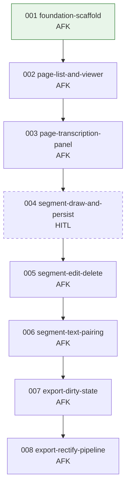

# Issue DAG

> Regenerated 2026-06-06

## Warnings

- **Fully sequential chain** — no two issues are independent; at most **one** AFK lane can run at any time. Parallelism is not available until the DAG is split (e.g. decouple backend modules from frontend slices).
- None (cycles, frontmatter drift, or missing blockers).

## Parallel lanes (ready now)

| Lane | Issues | Notes |
|------|--------|-------|
| **A** | `001-foundation-scaffold.md` | Only unblocked issue |

No second lane is available — every other issue transitively depends on 001.

## Stats

| Metric | Count |
|--------|------:|
| **Total issues** | 8 |
| **Ready (AFK)** | 1 |
| **Ready (HITL)** | 0 |
| **In progress** | 0 |
| **Review** | 0 |
| **Done** | 0 |
| **Blocked** | 7 |

| Type | Count |
|------|------:|
| AFK | 7 |
| HITL | 1 |

## Branch plan (when pulling work)

All branches off `main` (or annote base branch):

```
feat/001-foundation-scaffold   ← start here (only lane)
feat/002-page-list-and-viewer  ← after 001 merges
feat/003-page-transcription-panel
feat/004-segment-draw-and-persist   (HITL — user-owned)
feat/005-segment-edit-delete
feat/006-segment-text-pairing
feat/007-export-dirty-state
feat/008-export-rectify-pipeline
```

**Max parallel AFK lanes without approval:** 2 (per default config) — **currently usable: 1** due to DAG shape.

## Mermaid



## Dependency detail

| Issue | Type | Blocked by | Unblocks |
|-------|------|------------|----------|
| 001 foundation-scaffold | AFK | — | 002 |
| 002 page-list-and-viewer | AFK | 001 | 003 |
| 003 page-transcription-panel | AFK | 002 | 004 |
| 004 segment-draw-and-persist | **HITL** | 003 | 005 |
| 005 segment-edit-delete | AFK | 004 | 006 |
| 006 segment-text-pairing | AFK | 005 | 007 |
| 007 export-dirty-state | AFK | 006 | 008 |
| 008 export-rectify-pipeline | AFK | 007 | — |

## Parallelism opportunities (for future subagents)

The current vertical slices form a **single critical path**. To unlock parallel lanes later, consider splitting along these boundaries (not in scope unless issues are rewritten):

| Potential lane A | Potential lane B | Shared blocker |
|------------------|------------------|----------------|
| Backend: data layout + page catalogue API | Frontend: Next.js shell + routing | 001 foundation |
| Text line parser + transcription API | Page list UI + image viewer | 002 (needs page API) |
| Rectify processing module (unit tests) | Pairing panel UI | 006+ (late; needs annotation model) |

Until then, **one subagent / one branch at a time** on the critical path.
