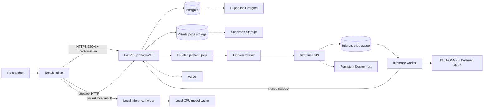
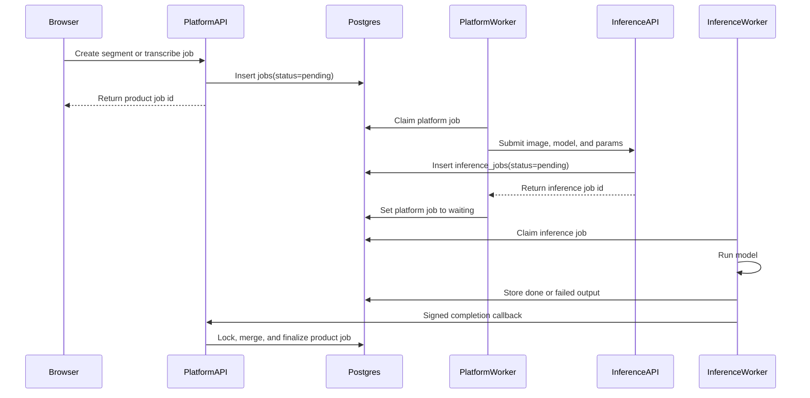
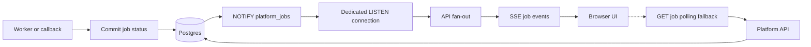
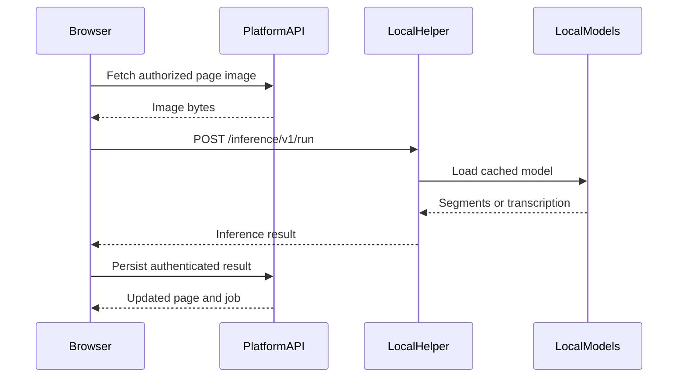

# Nomicous technical architecture

Nomicous separates the browser editor, platform API, persistence, and
CPU-intensive inference. The same workflow can use local inference, optional
remote inference, or a future model host.

## System overview



Local inference runs on the researcher’s machine through `127.0.0.1:8001`.
Remote inference creates a durable platform job, dispatches it through
persistent workers, and merges the signed callback into the platform state.
Local inference avoids a separate cloud ML service; the page still resides in
the configured platform storage.

## Stack choices

- **Next.js and React:** productive routing, standalone builds, and a
  responsive browser editor for annotation, pairing, review, and jobs.
- **FastAPI:** typed Python API contracts shared naturally with the inference
  and research code; bounded contexts cover users, projects, documents,
  annotations, ML, and jobs.
- **Postgres:** transactional source of truth for users, projects, sharing,
  annotations, transcription layers, model bindings, and durable jobs.
- **Supabase:** managed Postgres and private Storage. The browser does not use
  Supabase Auth, PostgREST, Realtime, Edge Functions, or direct Storage access.
- **Vercel:** suitable for the landing page, Next.js editor, and
  request/response API, but not long-running PyTorch workers.
- **Docker:** repeatable local packaging and persistent worker deployment.

## Annotation and sharing

```text
User
 └── Project
      ├── shared users
      └── Documents
            ├── Document parts (pages)
            │     ├── Blocks and Segments
            │     ├── page transcription lines
            │     └── review state and history
            └── Transcription layers
                  ├── model transcription
                  └── ground-truth transcription
```

A Segment is a user-drawn or model-created region for one written line. A
researcher may accept, edit, or ignore a Model transcription. It becomes
Ground truth only after that human decision. Paired segments can be exported
as processed line images and text files. Public documents use separate public
routes; draft documents remain protected.

Sharing is represented by project membership records and enforced by FastAPI
authorization. The platform does not automatically pair, approve, or publish
model output.

## Jobs and callbacks



The platform job is user-visible. `pending` means unclaimed, `running` means
the platform worker is processing it, `waiting` means inference accepted it,
and `done` or `failed` are terminal. Callback locking and terminal-state
checks make retries idempotent.

## Job notifications

Nomicous does not currently provide email, push, SMS, or third-party
notifications. Job progress uses Postgres `NOTIFY`, an API-local SSE fan-out,
and polling fallback:



Postgres remains authoritative. The state change commits first, then
`NOTIFY` wakes the listener. SSE reloads the authorized job before sending it.
If SSE is unavailable or idle, the frontend polls `GET /jobs/{id}`. Vercel
production disables long-lived listeners, so polling is the expected hosted
fallback.

## Local helper

The helper is a small FastAPI sidecar with no database, platform queue,
project authorization, or storage credentials:



It synchronizes the public registry with ETags, downloads weights lazily,
defaults to loopback, and caches weights at `~/.nomicous/hf/cache`. Exposing it
outside loopback requires secure mode, a strong helper secret, and TLS.

## Security boundaries

- Authentication is application-owned: password hashes, rotating sessions,
  JWT access tokens, and CSRF protection are implemented by FastAPI.
- The browser never connects directly to Postgres or private Storage.
- The API checks ownership or sharing before returning documents, images,
  annotations, and jobs.
- Inference workers receive only inference and callback credentials, not
  migration credentials or platform JWT secrets.
- Registry artifacts use pinned revisions and SHA-256 verification where
  configured.

For database roles, pooling, migrations, state machines, and callback
idempotency, see [`database-design.md`](database-design.md).
