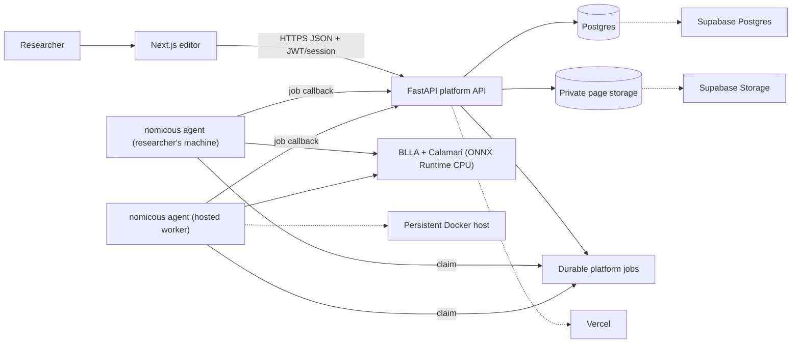
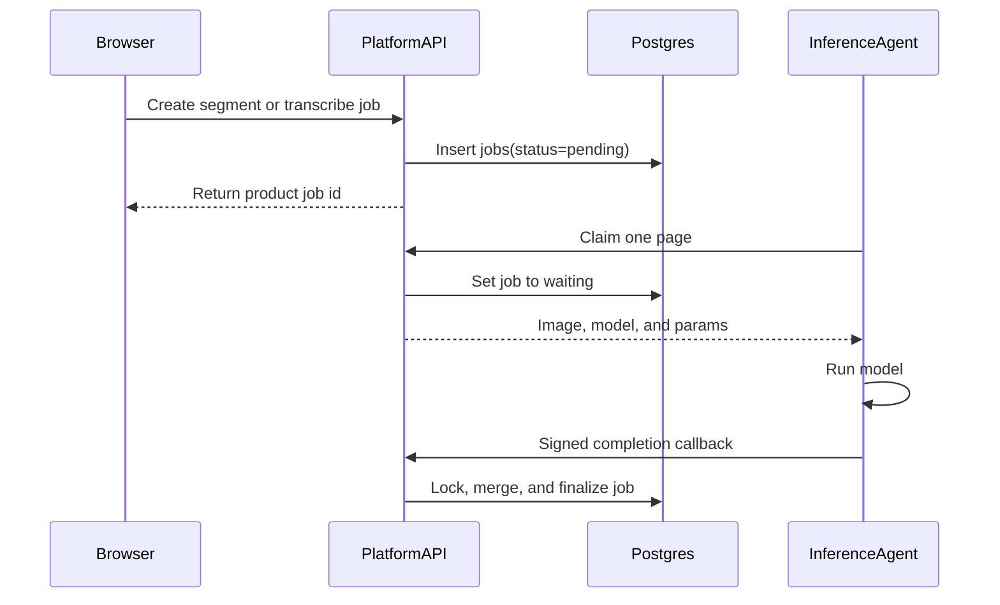
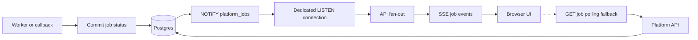
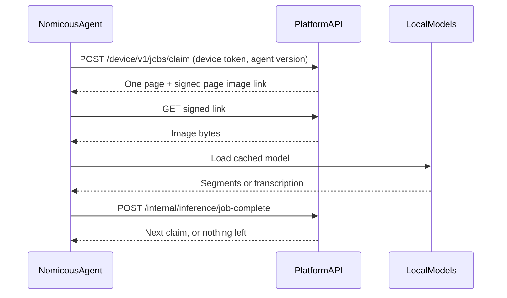

# Nomicous technical architecture

Nomicous separates the browser editor, platform API, persistence, and
CPU-intensive inference. The same workflow can use local inference, optional
remote inference, or a future model host.

## System overview


```mermaid
flowchart LR
    Researcher["Researcher"] --> Browser["Next.js editor"]
    Browser -->|"HTTPS JSON + JWT/session"| API["FastAPI platform API"]
    API --> DB[("Postgres")]
    API --> Storage[("Private page storage")]
    API --> Jobs["Durable platform jobs"]
    LocalAgent["nomicous agent (researcher's machine)"] -->|"claim"| Jobs
    HostedAgent["nomicous agent (hosted worker)"] -->|"claim"| Jobs
    LocalAgent --> Models["BLLA + Calamari (ONNX Runtime CPU)"]
    HostedAgent --> Models
    LocalAgent -->|"job callback"| API
    HostedAgent -->|"job callback"| API
    API -.-> Vercel["Vercel"]
    DB -.-> Supabase["Supabase Postgres"]
    Storage -.-> SupabaseStorage["Supabase Storage"]
    HostedAgent -.-> Docker["Persistent Docker host"]
```

Every arrow into the platform is outbound, and the browser is on none of them.
There is one queue (ADR 0003) and one **inference agent** (ADR 0002): the same
package runs on a researcher's laptop and on a hosted worker, differing only by
the credential it presents. Each agent takes one page at a time, downloads that
page through a short-lived signed link, runs the model in its own process, and
reports through the platform's existing job callback.

Which host a job runs on is fixed once, at submission, from the account-level
**host preference** and whether that host has **capacity** - and the job then
says which host ran it. An agent that is not running is an announced state, not
a failure: the work goes to the cloud and the researcher is told so.

## Stack choices

- **Next.js and React:** productive routing, standalone builds, and a
  responsive browser editor for annotation, pairing, review, and jobs.
- **FastAPI:** typed Python API contracts shared naturally with the inference
  and research code; bounded contexts cover users, projects, documents,
  annotations, ML, and jobs.
- **Postgres:** transactional source of truth for users, projects, sharing,
  annotations, transcription layers, model bindings, and durable jobs.
- **Supabase:** managed Postgres and private Storage. The browser does not use
  Supabase Auth, PostgREST, Realtime, Edge Functions, or direct Storage access.
- **Vercel:** suitable for the landing page, Next.js editor, and
  request/response API, but not long-running inference workers.
- **Docker:** repeatable local packaging and persistent worker deployment.

## Annotation and sharing

```text
User
 └── Project
      ├── shared users
      └── Documents
            ├── Document parts (pages)
            │     ├── Blocks and Segments
            │     ├── page transcription lines
            │     └── review state and history
            └── Transcription layers
                  ├── model transcription
                  └── ground-truth transcription
```

A Segment is a user-drawn or model-created region for one written line. A
researcher may accept, edit, or ignore a Model transcription. It becomes
Ground truth only after that human decision. Paired segments can be exported
as processed line images and text files. Public documents use separate public
routes; draft documents remain protected.

Sharing is represented by project membership records and enforced by FastAPI
authorization. The platform does not automatically pair, approve, or publish
model output.

## Jobs and callbacks


```mermaid
sequenceDiagram
    participant UI as Browser
    participant API as PlatformAPI
    participant DB as Postgres
    participant AG as InferenceAgent

    UI->>API: Create segment or transcribe job
    API->>DB: Insert jobs(status=pending)
    API-->>UI: Return product job id
    AG->>API: Claim one page
    API->>DB: Set job to waiting
    API-->>AG: Image, model, and params
    AG->>AG: Run model
    AG->>API: Signed completion callback
    API->>DB: Lock, merge, and finalize job
```

There is one queue and one database. The agent is a researcher's laptop or a
hosted worker, the same program with different credentials (ADR 0003).

The job is user-visible. `pending` means unclaimed, `running` means the
platform worker is processing it, `waiting` means an agent has taken it, and
`done` or `failed` are terminal. Callback locking and terminal-state checks
make retries idempotent.

## Job notifications

Nomicous does not currently provide email, push, SMS, or third-party
notifications. Job progress uses Postgres `NOTIFY`, an API-local SSE fan-out,
and polling fallback:


```mermaid
flowchart LR
    Worker["Worker or callback"] --> Commit["Commit job status"]
    Commit --> DB[("Postgres")]
    DB --> Notify["NOTIFY platform_jobs"]
    Notify --> Listener["Dedicated LISTEN connection"]
    Listener --> Fanout["API fan-out"]
    Fanout --> SSE["SSE job events"]
    SSE --> Browser["Browser UI"]
    Browser -.-> Poll["GET job polling fallback"]
    Poll --> API["Platform API"]
    API --> DB
```

Postgres remains authoritative. The state change commits first, then
`NOTIFY` wakes the listener. SSE reloads the authorized job before sending it.
If SSE is unavailable or idle, the frontend polls `GET /jobs/{id}`. Vercel
production disables long-lived listeners, so polling is the expected hosted
fallback.

## The inference agent

The agent is a command-line program with no database, no platform queue, no
project authorization, no storage credentials - and no listening socket:


```mermaid
sequenceDiagram
    participant A as NomicousAgent
    participant API as PlatformAPI
    participant M as LocalModels

    A->>API: POST /device/v1/jobs/claim (device token, agent version)
    API-->>A: One page + signed page image link
    A->>API: GET signed link
    API-->>A: Image bytes
    A->>M: Load cached model
    M-->>A: Segments or transcription
    A->>API: POST /internal/inference/job-complete
    API-->>A: Next claim, or nothing left
```

It reads the registry, downloads weights lazily, and caches them at
`~/.nomicous/hf/cache`. Nothing is exposed: there is no port to secure, no CORS
allowlist to maintain, and no browser permission to depend on. Before its first
claim it performs the **launch check** - asking the platform for the **version
floor** and replacing itself if it is below it - and never again while work is
in flight.

## Security boundaries

- Authentication is application-owned: password hashes, rotating sessions,
  JWT access tokens, and CSRF protection are implemented by FastAPI.
- The browser never connects directly to Postgres or private Storage.
- The API checks ownership or sharing before returning documents, images,
  annotations, and jobs.
- Inference workers receive only inference and callback credentials, not
  migration credentials or platform JWT secrets.
- Registry artifacts use pinned revisions and SHA-256 verification where
  configured.

For database roles, pooling, migrations, state machines, and callback
idempotency, see [`database-design.md`](database-design.md).
