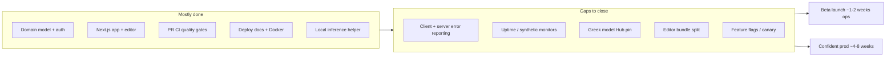

# Codebase audit — launch readiness

**Date:** 2026-07-10  
**Status:** Audit for review — findings from parallel exploration of backend,
frontend, ops/CI, and inference. No code changed in this document.

**Framework:** Five-axis review (correctness, readability, architecture,
security, performance) plus shipping-and-launch pre-launch checklist.

Related:

| Doc | Topic |
|-----|--------|
| [repository-hygiene.md](repository-hygiene.md) | Ongoing habits, gitignore, doc drift |
| [repository-cleanup-plan.md](repository-cleanup-plan.md) | Dead code audit (when present) |
| [deployment/production.md](deployment/production.md) | Production runbook and rollback thresholds |
| [deployment/release-evidence.md](deployment/release-evidence.md) | Per-deploy evidence template |

---

## Executive summary

| Area | Score | One-line verdict |
|------|-------|------------------|
| **Backend API** | **74%** | Mature domain model, auth, jobs, media — missing APM, refresh rate limit, fail-late storage config |
| **Frontend** | **72%** | Solid API/auth/image cache — missing error reporting, route error boundaries, editor code splitting |
| **Ops / CI / deploy** | **62%** | Strong PR CI + runbooks — no CD, no uptime monitoring, no feature flags, no `main` push CI |
| **Inference** | **74%** | Good contracts + security — Greek model unpinned, ML tests not in CI, callback failure can strand jobs |

**Composite (weighted toward product value):** ~**70%** for a **local-helper +
hosted platform** launch. ~**55%** for **cloud inference-first** without extra
ops work.

**Verdict:** Past the “does it work?” phase and into “can we operate it
safely?” Suitable for a **controlled beta** with manual monitoring. Not yet
hands-off public SaaS or cloud Greek HTR at scale.

---

## Launch curve

---

## Critical blockers

Issues that appear across multiple audit lanes. Gate a **public launch** until
addressed or explicitly accepted with compensating controls.

### 1. No production observability

No Sentry, Datadog, Prometheus, or equivalent on API or frontend. Failures are
discovered via user reports, not dashboards. Correlation IDs exist (`X-Error-ID`
on API errors) but nothing aggregates them.

**Evidence:** `nomicous/backend/core/app.py` (logging only); no error-reporting
imports in `nomicous/frontend/src/`.

### 2. No external health / uptime monitoring

`GET /health` works and probes the database (`nomicous/backend/core/api/health.py`).
No synthetic checks on `api.nomicous.com` or `app.nomicous.com` are configured.

### 3. Greek model unpinned

`greek-calamari-v1` in `inference/registry.yaml` lacks `hub_revision` and
`artifact_sha256` (Syriac is pinned). `src/hf/resolve/cache.py` requires both
for `hf://` resolution. Core HTR jobs can fail at weight load.

### 4. ML path not in CI

`.github/workflows/quality.yml` runs integration tests with `-m "not ml"`.
Full segment / transcribe / callback pipeline is not gated on every PR.

### 5. Frontend resilience gaps

- No client-side error reporting.
- No root `error.tsx` — only `global-error.next.tsx` and one nested editor
  `error.next.tsx`.
- `ProtectedRoute` returns `null` during auth restore (blank screen, no
  `aria-busy`).
- No E2E suite in CI (Playwright is a devDependency only).

### 6. Backend auth and ops edges

- `/auth/refresh` is not rate-limited (`users/api/auth.py`); login/register use
  `throttle_auth_attempts`.
- Supabase storage misconfiguration fails at first upload, not at boot
  (`core/settings/storage.py`).
- No runtime guard against `ENVIRONMENT=production` +
  `JOB_WORKER_ENABLED=true` on a serverless host (`core/app.py` lifespan).

---

## Important issues

Fix before **wide rollout** or treat as accepted risk with runbook coverage.

| Theme | Items |
|-------|--------|
| **Performance** | Page editor route has no `next/dynamic`; no bundle budget; Core Web Vitals not measured |
| **Security** | Open registration (no invite/captcha); `pip-audit` ignores known CVEs (Kraken/torch constraints in `security.yml`) |
| **Ops** | No CD; CI triggers on PR only (not `push` to `main`); no Dependabot; `release-evidence.md` is manual |
| **Inference** | Callback delivery failure can leave jobs stuck in `waiting`; shallow inference `/health`; `HF_CACHE_ROOT` vs `INFERENCE_WEIGHTS_CACHE_DIR` doc drift |
| **Backend** | Expired `auth_sessions` accumulate (no GC job); multi-replica SSE is process-local; no Python typecheck in CI |
| **Frontend** | No `loading.tsx` Suspense boundaries; test gaps on upload, sharing, background jobs UI |
| **Docs** | Some index links may point to files not on every branch; `repository-hygiene.md` incorrectly states `deployment.yml` is disabled — it runs on PR |

---

## Suggestions

Lower priority; improve ops maturity and developer experience.

- Fail-fast validation: `STORAGE_BACKEND=supabase` requires credentials at
  `create_app()` time.
- Rate-limit `/auth/refresh` with a separate, tighter window.
- Periodic `auth_sessions` GC for expired or revoked rows.
- Request-duration middleware + per-route latency metrics.
- Bundle analysis (`@next/bundle-analyzer`) and `optimizePackageImports` for
  `antd`.
- Form error association on login/register (`aria-describedby`).
- Add `scripts/check.sh` local pre-PR mirror of CI (see
  [repository-hygiene.md](repository-hygiene.md)).
- Synthetic `/health` checks (Better Stack, Checkly, UptimeRobot).
- Minimal Railway/Fly config files if cloud inference is planned.
- Code-sign helper releases for researcher distribution.

---

## Five-axis summary (whole product)

| Axis | Score | Rationale |
|------|-------|-----------|
| **Correctness** | **4/5** | Domain rules, jobs, auth, and contracts are solid; config fail-late and unpinned Greek weights are the main correctness risks |
| **Readability** | **4/5** | Clear bounded contexts, good READMEs and CONTEXT.md; hybrid `src/pages/` + `src/app/` and large `page-editor.css` add friction |
| **Architecture** | **4/5** | Clean platform ↔ inference boundary; worker separation; documented SSE multi-replica limits |
| **Security** | **4/5** | Strong baseline (JWT, CSRF, CORS allowlist, webhook timing-safe compare); gaps on refresh rate limit, open registration, CSP `unsafe-inline` |
| **Performance** | **3/5** | Image cache and server media headers help; editor bundle unverified, no CWV evidence, auth rate-limit adds DB writes |

---

## Area reports

### Backend API (`nomicous/backend/`) — 74%

**Strengths**

- Fail-fast production config for JWT and inference secrets
  (`core/settings/auth.py`, `core/settings/ml.py`).
- Postgres-backed, cross-worker auth rate limiting with advisory locks
  (`users/api/rate_limit.py`).
- Session security: `__Host-` cookie, HttpOnly, Secure, CSRF on refresh/logout.
- Stable public error contract with `X-Error-ID` (`core/app.py`).
- Public/private document boundary (`document/domain/access.py`).
- Media path traversal protection (`document/infrastructure/media_store/keys.py`).
- Job robustness: `FOR UPDATE SKIP LOCKED`, stale reclaim, callback idempotency.
- Upload hardening: size cap, PIL decompression bomb guard.
- ~130+ tests across unit and integration.

**Gaps**

| Item | Severity |
|------|----------|
| No external error reporting or metrics | Critical |
| Supabase storage fails at upload, not boot | Critical |
| `/auth/refresh` not rate-limited | Critical |
| No serverless worker guard | Critical |
| Auth session table grows unbounded | Important |
| Open registration | Important |
| No mypy/pyright in CI | Important |

**Distance:** 3–4 focused PRs for production-grade backend (observability,
config hardening, ops hygiene, optional typecheck in CI).

---

### Frontend (`nomicous/frontend/`) — 72%

**Strengths**

- Production-grade API layer: OpenAPI types, 401 recovery (fetch + SSE), CSRF,
  GET dedup with abort semantics.
- Reference-counted image cache with in-flight dedup, thumbnail `?w=` param,
  hover prefetch in `PartList`.
- Memory-only JWT; open-redirect protection on auth callbacks.
- Editor canvas accessibility (zoom controls, `aria-label`, `aria-live`).
- CI: typecheck, lint, test, build on every PR; security headers in
  `vercel.json`.
- `standalone` Next output; non-root Docker user.

**Gaps**

| Item | Severity |
|------|----------|
| No client error reporting | Critical |
| No root `error.tsx` | Critical |
| Auth restore blank screen | Critical |
| No editor code splitting (`next/dynamic`) | Important |
| No `loading.tsx` boundaries | Important |
| No E2E in CI | Important |
| No CWV / Lighthouse evidence | Important |

**Distance**

| Milestone | Effort |
|-----------|--------|
| Beta / internal | ~2–3 days |
| Public soft launch | ~1–2 weeks |
| Confident production | ~3–4 weeks |

---

### Ops / CI / deploy — 62%

**Strengths**

- Mature `docs/deployment/production.md` runbook (architecture, env tables,
  rollback triggers).
- PR CI: lint, typecheck, test, build, Postgres integration, OpenAPI contract
  drift, gitleaks, container SBOM + Trivy (`quality.yml`, `security.yml`,
  `deployment.yml`).
- Workers disabled on Vercel by default; security headers; auth rate limits.
- Health checks at HTTP, Docker, and Compose layers.
- Helper release workflow: SHA256SUMS, SPDX SBOM, attestations.
- Database ops: service roles, migrator separation, Alembic downgrade paths.
- `tests/nomicous/unit/test_deployment_hardening.py` guards deploy invariants.

**Gaps**

| Item | Severity |
|------|----------|
| No APM / centralized error tracking | Critical |
| No automated deployment pipeline | Critical |
| CI not on `push` to `main` | Critical |
| No external uptime monitoring | Critical |
| No feature-flag or canary system | Important |
| ML tests excluded from CI | Important |
| No browser E2E | Important |
| No Dependabot | Important |
| `release-evidence.md` not enforced | Important |

**Rollback readiness**

| Mechanism | Status |
|-----------|--------|
| Vercel instant rollback | ✅ Documented |
| Alembic downgrade | ✅ All migrations have `downgrade()` |
| Feature-flag kill switch | ❌ |
| Rollback dry run | ❌ Not scripted |

**Staged rollout:** Env toggles only (`CLOUD_INFERENCE_ENABLED`,
`ENABLE_TEST_JOB_ROUTES`). No percentage canary. Default posture is big-bang
deploy + manual observation.

---

### Inference (`inference/`) — 74%

**Strengths**

- Strong `inference/CONTEXT.md` vocabulary.
- Shared admission layer (`inference/admission.py`) across API, jobs, helper.
- Production fail-closed secrets; `compare_digest` for auth headers.
- Queue admission with `pg_advisory_xact_lock` across API replicas.
- Worker: `LISTEN/NOTIFY`, `FOR UPDATE SKIP LOCKED`, stale running-job reclaim.
- Calamari runtime decoupled from research (`inference/architectures/calamari/`).
- Immutable Hub provenance: commit + SHA-256 digest (`src/hf/resolve/cache.py`).
- Helper release workflow and supply-chain CI (Trivy, SBOM).

**Gaps**

| Item | Severity |
|------|----------|
| `greek-calamari-v1` unpinned | Critical |
| ML integration tests not in CI | Critical |
| Callback failure → stuck `waiting` jobs | Critical |
| `HF_CACHE_ROOT` vs `INFERENCE_WEIGHTS_CACHE_DIR` drift | Critical |
| Cloud inference needs 3 coordinated processes | Critical |
| Shallow `/health` on inference API | Important |
| Unsigned helper installers | Important |
| Per-process rate limiting only | Important |

**Integration risks (platform ↔ inference)**

| Risk | Detail |
|------|--------|
| Secret triplet must match | `INFERENCE_SERVICE_SECRET`, `INFERENCE_WEBHOOK_SECRET`, `INFERENCE_CALLBACK_URL` |
| Two execution paths | Cloud: platform-worker → inference API → callback. Local: browser → helper → platform persist |
| Dual catalog sync | `inference/registry.yaml`, Postgres `inference_models`, Hub artifacts — manual alignment |
| Shared Postgres queue | `inference_jobs` schema is a platform migration dependency |

---

## Launch modes

| Mode | Readiness | What's left |
|------|-----------|-------------|
| **A. Platform + local helper (default)** | **~75%** | Pin Greek weights, client error reporting, uptime monitor, one Playwright smoke test, fill `release-evidence` once |
| **B. + Cloud inference** | **~55%** | Mode A + 3-process deploy, callback reconciliation, cache volume, ML smoke in CI/staging |
| **C. Full SaaS maturity** | **~45%** | Mode B + feature flags, APM dashboards, e2e suite, Dependabot, automated staging→prod |

**Inference impact on product:** The platform shell can launch independently.
Inference is the gating subsystem for the core HTR value proposition. Until
Greek weights are pinned and the ML path is verified in CI, public claims of
production Greek transcription are ahead of runtime reality.

---

## Pre-launch checklist

Snapshot against shipping-and-launch sections. Use
[deployment/production.md](deployment/production.md) for the full operator
checklist.

### Code quality

| Item | Status | Notes |
|------|--------|-------|
| Unit / integration tests in CI | ✅ | `quality.yml`; ML excluded |
| Frontend build in CI | ✅ | typecheck + lint + test + build |
| Python lint | ✅ | Ruff in CI |
| Python typecheck | ❌ | No mypy/pyright gate |
| No blocking TODOs in product code | ✅ | Verified in backend and frontend `src/` |
| Error handling on API | ✅ | Unified handlers, stable envelopes |
| Error handling on UI | ⚠️ | Partial — sparse route error boundaries |

### Security

| Item | Status | Notes |
|------|--------|-------|
| Secrets not in VCS | ✅ | gitleaks in CI |
| Dependency audit | ⚠️ | npm + pip-audit with documented ignores |
| Input validation | ✅ | Pydantic; upload limits |
| AuthN / AuthZ | ✅ | JWT + session; document access layers |
| Security headers | ✅ | API + `vercel.json` |
| Rate limiting on auth | ⚠️ | Login/register only |
| CORS not wildcard | ✅ | Explicit allowlist |

### Performance

| Item | Status | Notes |
|------|--------|-------|
| Core Web Vitals | ❌ | Not verified |
| Image optimization | ⚠️ | WebP + thumbnails + client blob cache |
| Bundle within budget | ❌ | No budget; large editor chunk likely |
| N+1 queries | ⚠️ | `selectinload` used; not fully audited |
| Server media caching | ✅ | ETag / Cache-Control on media responses |

### Accessibility

| Item | Status | Notes |
|------|--------|-------|
| Keyboard navigation | ⚠️ | Editor and modals good; canvas keyboard unclear |
| Screen reader structure | ⚠️ | Auth loading gap |
| Modal focus management | ✅ | `FormModal` focus trap |
| Form errors associated | ❌ | Toast-only on auth forms |
| axe / Lighthouse in CI | ❌ | Not configured |

### Infrastructure

| Item | Status | Notes |
|------|--------|-------|
| Env vars documented | ✅ | `.env.production.example` per service |
| Migrations ready | ✅ | Alembic; CI runs `upgrade head` |
| Health check endpoint | ✅ | `/health` with DB probe |
| Logging | ✅ | Structured logging with correlation ID |
| Error reporting / APM | ❌ | Not configured |
| Uptime monitoring | ❌ | Not configured |
| Automated prod deploy | ❌ | Manual Vercel |
| Feature flags | ❌ | Env toggles only |

### Documentation

| Item | Status | Notes |
|------|--------|-------|
| Deployment runbook | ✅ | `production.md` |
| Release evidence template | ✅ | `release-evidence.md` |
| ADRs | ✅ | `docs/adr/` |
| Doc index integrity | ⚠️ | Some cross-links may 404 on partial branches |

---

## Positive findings (cross-cutting)

1. **Architecture documentation** — `nomicous/backend/README.md`,
   `inference/CONTEXT.md`, and `nomicous/CONTEXT.md` are unusually thorough.
2. **Security baseline** — Fail-closed prod config, CSRF, timing-safe webhook
   compare, stable error envelopes, media path guards.
3. **CI depth on PR** — Quality, security, deployment image checks, OpenAPI
   contract drift detection.
4. **Local-helper-first posture** — Reduces v1 launch complexity; cloud
   inference is opt-in via `CLOUD_INFERENCE_ENABLED`.
5. **Job system** — Idempotent callbacks, row locks, stale reclaim — suitable
   for async ML workloads.
6. **Frontend API layer** — Auth recovery, GET dedup, and image cache are
   launch-quality implementations.
7. **Research / product boundary** — Calamari training (`src/model/`) separated
   from PyTorch runtime (`inference/architectures/calamari/`).

---

## Recommended implementation order

### Week 1 — Launch blockers

1. Sentry (or equivalent) on API + Next.js, wired to `X-Error-ID`.
2. External `/health` synthetic monitor for API and app.
3. Pin `greek-calamari-v1` in `inference/registry.yaml` (`hub_revision` +
   `artifact_sha256`).
4. Root `error.tsx` + auth loading UI (spinner / skeleton with `aria-busy`).
5. Rate-limit `/auth/refresh`; fail-fast Supabase storage validation at boot.

### Week 2 — Beta hardening

6. `next/dynamic` for page editor route.
7. Nightly or manual CI job for `@pytest.mark.ml` smoke tests.
8. One Playwright smoke path in CI: login → open document.
9. Align deploy docs on `HF_CACHE_ROOT` as canonical cache path.
10. Fill one [release-evidence.md](deployment/release-evidence.md) for a real
    deploy.

### Weeks 3–4 — Cloud inference (if needed)

11. Callback reconciliation for stuck `waiting` jobs.
12. Railway/Fly configs + worker health monitoring.
13. Bundle budget + Lighthouse on key routes.
14. Add `push: branches: [main]` to CI workflows as safety net.

---

## Staged rollout guidance

No feature-flag system exists today. Until one is added:

1. **Deploy with cloud inference OFF** — verify health and error baselines.
2. **Enable for team** — internal users only; 24-hour monitoring window.
3. **Manual canary** — invite-only beta cohort; record metrics in
   `release-evidence.md`.
4. **Advance only if thresholds pass** (from `production.md`):

| Metric | Advance | Hold | Roll back |
|--------|---------|------|-----------|
| Error rate | Within 10% of baseline | 10–100% above | >2× baseline |
| P95 latency | Within 20% of baseline | 20–50% above | >50% above |
| New client JS errors | None | <0.1% of sessions | >0.1% of sessions |

**Rollback triggers:** Error rate >2× baseline, P95 >50% above baseline, data
integrity issues, or security vulnerability. Vercel rollback is the fastest
path (~minutes); Alembic downgrade is manual (~15+ minutes).

---

## Review checklist

Use before treating this audit as launch sign-off:

- [ ] Critical blockers addressed or explicitly accepted with compensating controls
- [ ] One filled `release-evidence.md` for target commit
- [ ] PR CI green including `deployment.yml`
- [ ] Migrations applied; DB roles verified per `database-roles.md`
- [ ] Preview deploy smoke-tested; production promoted
- [ ] API p50/p95/error baseline recorded
- [ ] First-hour manual checks per `production.md` completed
- [ ] Doc index links verified on release branch

---

## Changelog

| Date | Change |
|------|--------|
| 2026-07-10 | Initial parallel audit — backend, frontend, ops/CI, inference |
