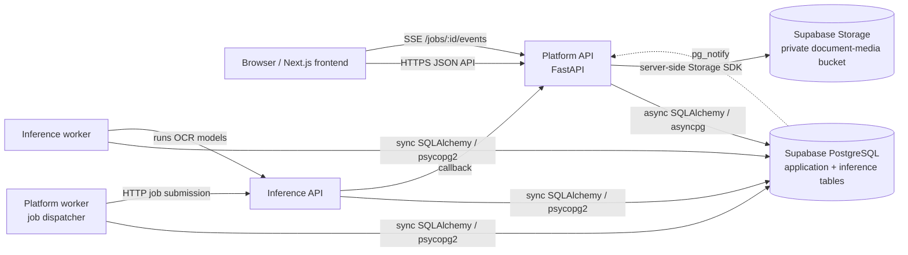
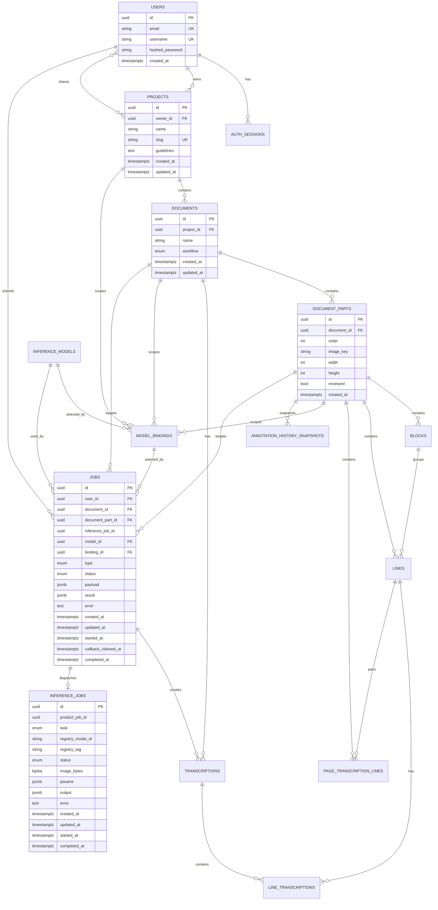
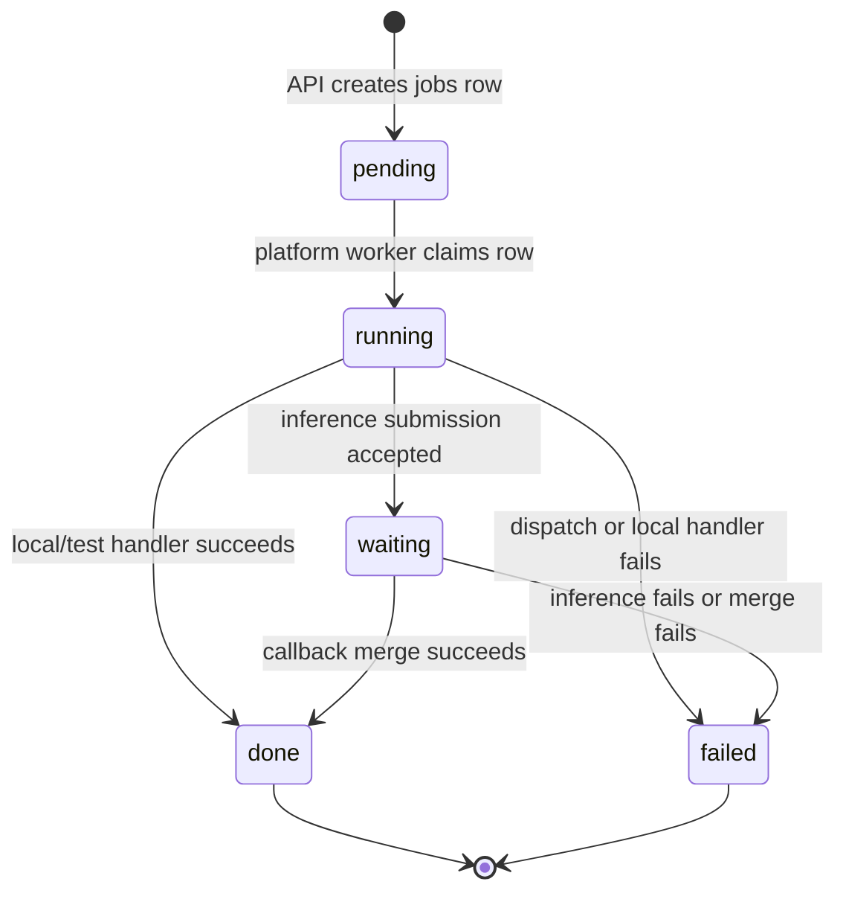
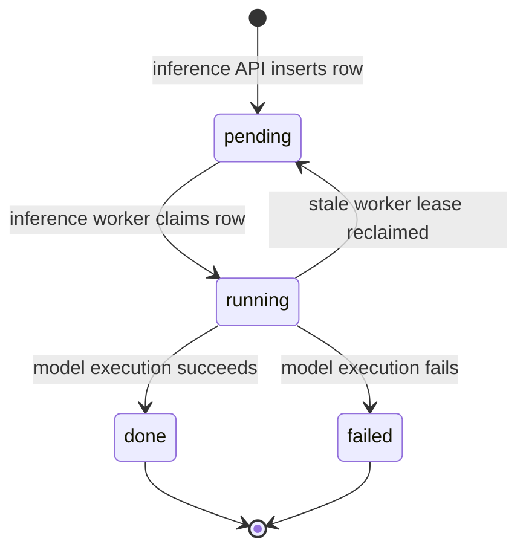
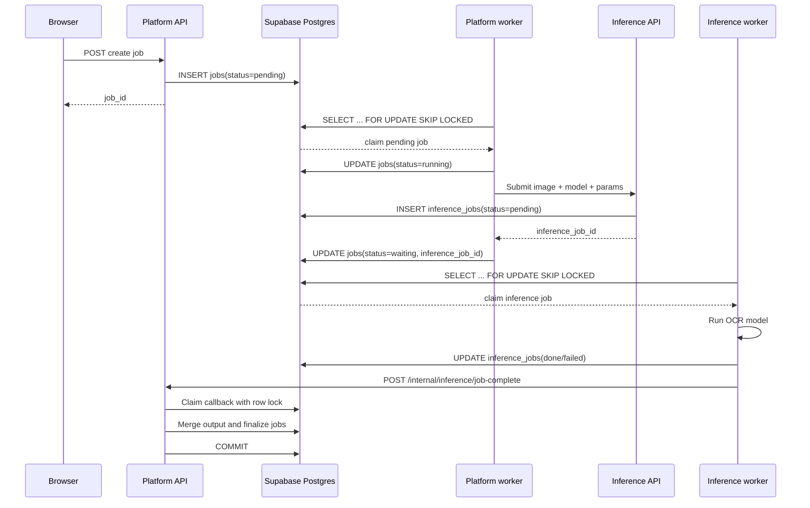
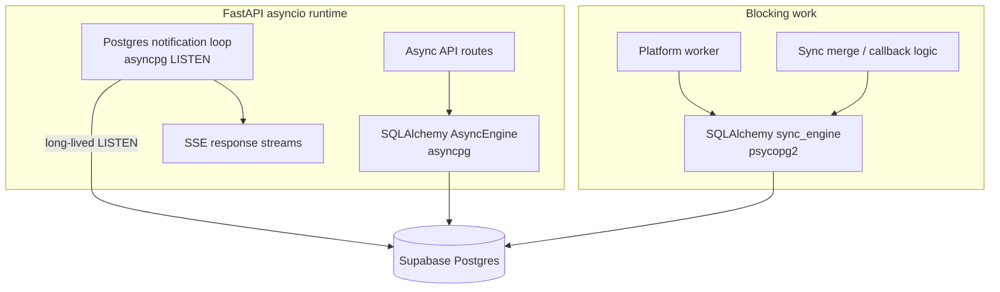
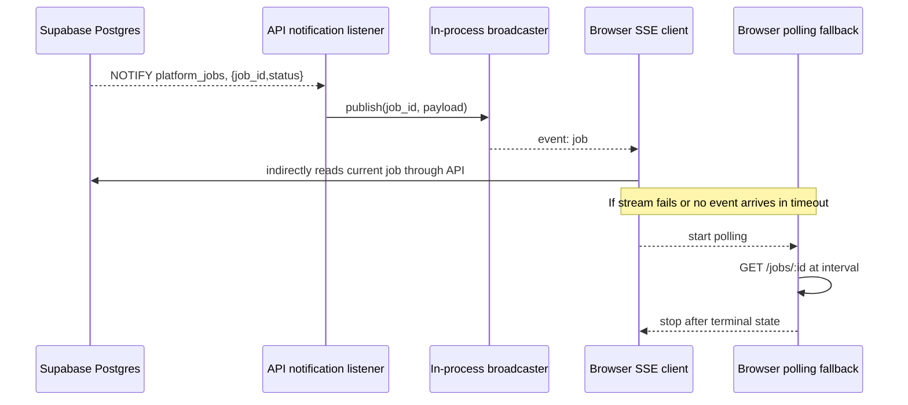
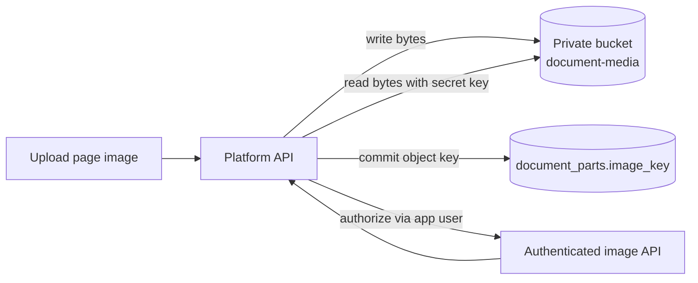

# Database design and execution model

This document describes the database design used by the Nomicous/greekOCR
platform, including the Supabase deployment profile. It is intended to help
new contributors understand:

- which tables exist and how they relate;
- which service owns each part of the database;
- when code uses asynchronous or synchronous database access;
- how platform and inference jobs move through the system;
- how Postgres `NOTIFY`, server-sent events (SSE), and polling fit together;
- which connection, pooling, security, and transaction rules must be preserved.

The schema source of truth is the Alembic migration history under
`nomicous/infrastructure/alembic/versions/`. SQLAlchemy ORM models mirror the
schema but do not replace migrations.

## 1. High-level architecture

Supabase is used as managed PostgreSQL and object storage. The browser does not
connect directly to Supabase PostgREST, Supabase Auth, or Supabase Realtime.
The browser talks to the FastAPI platform API, which enforces application
authentication and authorization.



There are two related job records:

1. `jobs` is the **platform job**. It represents user-visible work such as
   segmentation or transcription.
2. `inference_jobs` is the **inference job**. It contains the image bytes and
   model execution payload used by the inference service.

The two records are linked by `jobs.inference_job_id` and
`inference_jobs.product_job_id`.

## 2. Database boundaries and service ownership

The database is shared, but access is divided by service role. The API owns
user-facing application data. The platform worker reads application context and
updates platform job dispatch state. The inference service owns the
`inference_jobs` queue.

| Component | Primary responsibility | Database access |
|---|---|---|
| Migrator/operator | Alembic DDL and schema changes | Direct PostgreSQL connection; `MIGRATOR_DATABASE_URL` |
| Platform API | Auth, projects, documents, annotations, job state, callbacks | Async SQLAlchemy for request work; API service role |
| Platform worker | Claims platform jobs and dispatches inference requests | Sync SQLAlchemy; platform-worker role |
| Inference API | Accepts inference submissions and exposes inference status | Sync SQLAlchemy; inference-worker role |
| Inference worker | Claims and executes `inference_jobs` | Sync SQLAlchemy; inference-worker role |
| Browser | UI and job observation | Never connects directly to PostgreSQL or private Storage |
| Supabase Storage | Page image object storage | Backend only, using the secret Storage key |

The application currently uses app-owned JWT authentication. Supabase Auth is
not part of the login/session model.

## 3. Relational schema

The following diagram shows the principal tables and foreign-key relationships.
The diagram omits some repeated timestamp columns and indexes to remain
readable; the table catalog below is authoritative for column details.



### 3.1 Identity and access tables

#### `users`

Application users. Passwords are stored as hashes. The table is not
`auth.users` from Supabase Auth.

- `id`: UUID primary key.
- `email`: unique login/contact address.
- `username`: unique display/login identifier.
- `hashed_password`: application password hash.
- `created_at`: creation timestamp.

#### `auth_sessions`

Durable browser sessions for rotating credentials and CSRF protection.

- `user_id` cascades to the owning user.
- `token_hash` stores only a credential hash, never the raw token.
- `csrf_token_hash` stores the CSRF credential hash.
- `expires_at` and `revoked_at` control validity.
- Indexes support lookup by user and expiration.

#### `auth_rate_limit_attempts`

Shared database state for authentication rate limiting.

- `key`: rate-limit bucket key.
- `attempted_at`: timestamp of the attempt.
- Composite index `(key, attempted_at)` supports time-window queries.

#### `project_shared_users`

Many-to-many project sharing table.

- Composite primary key: `(project_id, user_id)`.
- Both foreign keys cascade on deletion.
- A project owner is stored separately in `projects.owner_id`.

### 3.2 Project and document tables

#### `projects`

Top-level collaboration boundary.

- `owner_id` uses `ON DELETE SET NULL`.
- `slug` is unique and indexed.
- `documents` and model bindings are scoped to the project.

#### `documents`

A manuscript/document within a project.

- `project_id` cascades on project deletion.
- `workflow` is one of `draft`, `published`, or `archived`.
- A document owns its parts and transcription layers.

#### `document_parts`

A page or image-bearing part of a document.

- `order` is unique per document through
  `uq_document_parts_document_order`.
- `image_key` points to an object in the configured media backend.
- In the Supabase profile, the key points to the private `document-media`
  bucket, normally under `parts/<part-id>/<name>.webp`.
- `reviewed` tracks page-level review state.

#### `blocks`

Layout regions grouping related lines.

- `box` stores layout geometry as JSONB.
- `manual_geometry` indicates a human override.
- `order` controls display order.
- Deleting the page cascades to blocks.

#### `lines`

Recognized or manually created text-line geometry.

- `block_id` is nullable and becomes null if the block is deleted.
- `baseline`, `mask`, `points`, and `source_metadata` store geometry/model
  metadata as JSONB.
- `kind` is `polygon` or `rectangle`.
- `source` is `manual`, `kraken`, or `model`.
- `kraken_ceiling` stores Kraken-specific geometry when present.
- Lines are ordered within a page by `part_id`, `order`, and `created_at`.

#### `page_transcription_lines`

Page-level transcription rows used by the editor and pairing workflow.

- `(part_id, order)` is unique.
- `paired_line_id` optionally links a page transcription row to a recognized
  line.
- `paired_line_id` is unique, so one recognized line cannot be paired twice.
- Deleting the recognized line clears the pairing.

#### `annotation_history_snapshots`

Restorable snapshots of page annotation state.

- `state` stores the compact JSONB snapshot.
- `line_count` and `paired_line_count` provide summary metadata.
- Indexed by `(part_id, created_at)` for history browsing.
- Deleting the page cascades to its snapshots.

#### `media_deletion_intents`

Durable outbox records for object-store deletion.

This table prevents a database transaction from losing track of an image that
must be deleted from Supabase Storage or the local media backend.

- `image_key` is unique.
- `attempts` and `last_error` support retries and diagnostics.
- `completed_at IS NULL` identifies pending work.
- The media garbage-collection loop processes these records.

### 3.3 Transcription tables

#### `transcriptions`

A transcription layer for a document.

- `kind` is `ground_truth` or `model`.
- `created_by_job_id` optionally records the platform job that produced it.
- A partial unique index allows only one `ground_truth` layer per document.
- Deleting a document cascades to its transcription layers.

#### `line_transcriptions`

Text and confidence for a line within a transcription layer.

- Each row joins one `line` to one `transcription`.
- `(line_id, transcription_id)` is unique.
- `text` is the recognized or edited text.
- `confidence` is nullable because manual text may not have a model score.

### 3.4 Inference catalog tables

#### `inference_models`

Application-level model catalog.

- `name` is unique.
- `provider` identifies the execution provider.
- `task` is `segment`, `transcribe`, or `binarize`.
- `artifact_ref` identifies the model artifact, commonly a registry URI.
- `default_params` stores JSONB defaults.

#### `model_bindings`

A model selection and parameter override scoped to a project, document, or
document part.

- `model_id` is required.
- Exactly which scope is populated is determined by application rules:
  `project_id`, `document_id`, and `document_part_id` are nullable.
- `overrides` stores JSONB parameter overrides.
- Scope foreign keys cascade when their owning resource is deleted.

### 3.5 Job tables

#### `jobs` — platform job queue

This is the user-visible state machine.

| Column | Meaning |
|---|---|
| `id` | Platform job identifier returned to the frontend |
| `type` | `segment`, `transcribe`, `binarize`, or `pipeline` |
| `status` | `pending`, `running`, `waiting`, `done`, or `failed` |
| `payload` | Request-specific JSONB input |
| `result` | User-visible JSONB output |
| `error` | Safe public failure message |
| `inference_job_id` | Inference-service job identifier after dispatch |
| `callback_claimed_at` | Idempotency/concurrency lease for callback processing |
| `started_at` | Platform worker claim time |
| `completed_at` | Terminal completion time |

The pending-claim index orders work by `(created_at, id)` and the JSONB GIN
index supports payload filtering. References to users, documents, parts,
models, and bindings use `SET NULL`, preserving job history if source objects
are later removed.

#### `inference_jobs` — inference-owned queue

This queue is used by the inference API and inference worker.

- `product_job_id` points back to `jobs.id` logically; it is indexed but is not
  declared as a database foreign key because the inference service has a
  separate ownership boundary.
- `image_bytes` contains the input image for the inference execution.
- `registry_model_id` and `registry_tag` identify the resolved model artifact.
- `params` contains task parameters, including line regions for transcription.
- `output` and `error` hold execution results.
- Claiming uses `(status, created_at, id)` ordering.

## 4. Enumerations and state machines

### 4.1 Platform job states



`waiting` means the platform has handed work to the inference service and is
waiting for a callback. It does not mean the job is idle or lost.

### 4.2 Inference job states



Admission is bounded. The inference API serializes the active-job count and
insert using a PostgreSQL advisory transaction lock. This avoids multiple API
processes accepting work beyond the configured queue capacity.

### 4.3 Job dispatch and callback sequence



## 5. Async and sync database access

The application intentionally maintains two SQLAlchemy engines because the
FastAPI request path and the worker/listener path have different execution
needs.

### 5.1 Async engine

Configured from `DATABASE_URL`, normally:

```text
postgresql+asyncpg://...
```

The async engine is used by:

- FastAPI dependency `get_db()`;
- normal API repositories and services;
- job creation and job status reads;
- SSE request handling;
- callback route dependency wiring.

Typical usage:

```python
async with AsyncSessionLocal() as session:
    result = await session.execute(statement)
    await session.commit()
```

An async route can serve other requests while waiting for a database query.
This is cooperative concurrency: database calls must be awaited, and CPU-heavy
or blocking functions must not run directly on the event loop.

### 5.2 Sync engine

Configured from `SYNC_DATABASE_URL`, normally:

```text
postgresql://...
```

The sync engine is used by:

- the platform worker's claim and update operations;
- inference API/worker queue operations;
- synchronous merge services;
- synchronous model/image preparation code;
- PostgreSQL `pg_notify` emission.

Typical usage:

```python
with sync_system_session() as session:
    job = session.get(Job, job_id)
    session.commit()
```

The worker loop calls these blocking operations through
`asyncio.to_thread(process_one_job)`, keeping the worker's asyncio control loop
responsive while the synchronous database work runs in a thread.

### 5.3 `asyncpg` listener on the sync URL

The platform notification listener uses an `asyncpg.Connection` directly, but
it connects using `SYNC_DATABASE_URL`. The variable name identifies the
connection profile and credentials; it does not require the driver itself to be
synchronous.

The listener needs a long-lived PostgreSQL session for `LISTEN`, while normal
request queries are short-lived pooled operations.



### 5.4 Important blocking caveat

The callback route is declared `async`, but `JobCallbackService.apply_callback`
currently invokes synchronous callback validation, merge, and finalization
logic. The sync work uses `sync_system_session()` and may block the FastAPI
event loop while it runs.

This is currently functionally safe because the callback is short-lived and
the database transaction locking provides idempotency. If callback merges become
large or latency matters, move the blocking operation behind
`asyncio.to_thread()` or implement the merge path with `AsyncSession`.
Whichever approach is chosen, preserve the transaction boundaries and callback
claim lock described below.

## 6. Connection profiles and Supabase poolers

| Variable | Driver | Intended connection | Use |
|---|---|---|---|
| `MIGRATOR_DATABASE_URL` | psycopg2/libpq | Direct PostgreSQL, usually port 5432 | Alembic migrations and operator tasks |
| `DATABASE_URL` | asyncpg | Transaction pooler, usually port 6543 | Async API runtime |
| `SYNC_DATABASE_URL` | psycopg2 and direct asyncpg listener | Transaction pooler or direct connection | Workers, sync services, and `LISTEN` |

Rules:

1. Use the direct connection for migrations and DDL.
2. Use the transaction pooler for short-lived application traffic when
   appropriate.
3. Asyncpg URLs use `ssl=require`; libpq URLs use `sslmode=require`.
4. The infrastructure code rewrites `sslmode=` to `ssl=` for asyncpg URLs.
5. Transaction-pooler connections disable asyncpg prepared-statement caching
   because PgBouncer transaction mode cannot safely retain prepared statements
   across backend sessions.
6. Database passwords must be URL-encoded. For example, `@` becomes `%40` and
   `#` becomes `%23`.

The application and worker pools are configured with `DB_POOL_SIZE`,
`DB_MAX_OVERFLOW`, and `DB_POOL_RECYCLE`. `pool_pre_ping` is enabled to discard
stale connections.

## 7. Job notifications, SSE, and polling fallback

The browser does not use Supabase Realtime. Job progress is implemented with
PostgreSQL `NOTIFY` plus an API-local SSE broadcaster.



The notification payload is only a hint. The SSE endpoint reloads the current
job row before sending the event, so the database remains authoritative.

The flow is:

1. A transaction updates a job and commits.
2. The application emits `pg_notify` with the job ID and status.
3. The API process listening on `platform_jobs` receives the payload.
4. The process publishes the payload to in-memory queues for matching SSE
   subscribers.
5. Each SSE request reloads the authorized job from PostgreSQL and sends the
   complete current representation.
6. The browser falls back to `GET /jobs/:id` polling if SSE is unavailable,
   times out, or returns an invalid response.

Operational consequences:

- The broadcaster is per API process, not a shared queue.
- PostgreSQL `NOTIFY` is process-independent, so each API process can receive
  the event, but only subscribers connected to that process receive its local
  queue event.
- A missed notification does not lose job state; the browser's polling fallback
  eventually reads the committed row.
- `NOTIFY` is not a durable event log and must not be treated as one.
- Heartbeats keep idle SSE connections observable.

## 8. Transaction and concurrency rules

### 8.1 Claiming jobs

Both job queues use:

```sql
SELECT ...
FROM jobs
WHERE status = 'pending'
ORDER BY created_at, id
FOR UPDATE SKIP LOCKED
LIMIT 1;
```

The selected row is marked `running` in a transaction. `SKIP LOCKED` allows
multiple workers to process different jobs without waiting on each other's
claims. It prevents two workers from claiming the same row at the same time.

### 8.2 Reclaiming stale work

Workers periodically reset jobs that have remained `running` beyond the
configured lease timeout. This protects the queue when a worker process crashes
after claiming work.

The same rule applies to inference jobs. A reclaimed inference job returns to
`pending` and can be claimed by another worker.

### 8.3 Callback idempotency

Inference callbacks can be retried. The platform callback handler:

1. locks the target platform job with `FOR UPDATE`;
2. verifies the task and `inference_job_id`;
3. ignores already-terminal jobs;
4. rejects callbacks for jobs that are not waiting;
5. sets `callback_claimed_at` before doing the merge;
6. merges the model result in a transaction;
7. finalizes the job as `done` or marks it `failed`.

This prevents duplicate callbacks from applying the same merge twice.

### 8.4 Notification ordering

The database row is the source of truth. A notification should be emitted
after the state-changing transaction commits. If notification delivery fails,
the application logs the failure and the browser can recover through polling.

## 9. Storage design

Only page images are stored in Supabase Storage. The database stores the
logical object key in `document_parts.image_key`.



The bucket is private. The browser receives image bytes through the platform
API, which applies the same application authorization used for document data.
Exports, model weights, and annotation JSON are not stored in this bucket.

Deletion is eventually consistent across the database and object store:

1. the database transaction creates a `media_deletion_intents` row;
2. a garbage-collection loop attempts object deletion;
3. failures increment `attempts` and record `last_error`;
4. `completed_at` marks successful deletion.

## 10. Security model

### 10.1 Application authorization

The normal API uses app JWT/session authentication and checks ownership or
sharing before returning project, document, image, and job data.

### 10.2 PostgreSQL roles

The current migrations define service role groups:

| Role group | Intended access |
|---|---|
| `nomicous_migrator` | Schema and full database administration for migrations |
| `nomicous_api` | CRUD access to application tables |
| `nomicous_platform_worker` | Read job context and update `jobs` |
| `nomicous_inference_worker` | Read and update `inference_jobs` |

Provider-managed login principals should be granted exactly one appropriate
group role. Credentials belong in the deployment secret store.

### 10.3 Row-level security

The production security migration enables and forces RLS on application tables.
The API sets transaction/session context such as the current application user
when RLS-aware access is used. The policies use helper functions to evaluate
project, document, and part access.

Do not assume that a database login role alone provides user-level
authorization. The service role and application context are separate layers.

The inference worker is deliberately limited to the inference queue and should
not receive application JWT secrets, Storage service-role keys, or migration
credentials.

## 11. Schema change workflow

1. Modify or add an Alembic migration under
   `nomicous/infrastructure/alembic/versions/`.
2. Update SQLAlchemy ORM models if runtime code uses the changed table.
3. Update the relevant service/repository tests.
4. Run the migration against a development database first.
5. Run database security/advisor checks for production Supabase.
6. Verify indexes, foreign-key behavior, RLS behavior, and service-role
   permissions.
7. Update this document when a table, ownership boundary, state transition, or
   connection rule changes.

Do not use Supabase Data API or client-side `supabase-js` as a shortcut around
the FastAPI authorization boundary unless the application design explicitly
changes to support that model.

## 12. Practical troubleshooting

| Symptom | Likely cause | Check |
|---|---|---|
| `DuplicatePreparedStatementError` | Asyncpg statement cache used through transaction pooler | Confirm `DATABASE_URL` uses pooler and cache size is zero |
| `connect() got unexpected keyword argument 'sslmode'` | `sslmode` passed directly to asyncpg | Confirm URL rewriting or use `ssl=require` |
| Job remains `pending` | Platform worker disabled or cannot claim rows | Check worker logs, role grants, and `JOB_WORKER_ENABLED` |
| Job remains `waiting` | Inference callback failed or was rejected | Check callback secret, inference job status, and callback logs |
| UI does not update immediately | `NOTIFY`/SSE path unavailable | Confirm notification listener and use polling fallback |
| Image request is denied | Missing document authorization or wrong Storage secret | Check API access and private bucket configuration |
| Duplicate OCR result risk | Callback idempotency fields not preserved | Check `callback_claimed_at`, row locks, and terminal-state handling |
| Migration cannot run | Pooler or insufficient migrator privileges | Use direct `MIGRATOR_DATABASE_URL` and the migrator role |

## 13. Source files

The main implementation references for this design are:

- `nomicous/infrastructure/db.py`
- `nomicous/backend/core/settings/infrastructure.py`
- `nomicous/backend/jobs/infrastructure/orm_models.py`
- `nomicous/backend/jobs/infrastructure/worker.py`
- `nomicous/backend/jobs/infrastructure/notifications.py`
- `nomicous/backend/jobs/application/job_callback_service.py`
- `nomicous/backend/document/infrastructure/orm_models.py`
- `nomicous/backend/project/infrastructure/orm_models.py`
- `nomicous/backend/users/infrastructure/orm_models.py`
- `nomicous/backend/ml/infrastructure/orm_models.py`
- `inference/infrastructure/orm_models.py`
- `inference/infrastructure/job_repository.py`
- `nomicous/infrastructure/alembic/versions/`
- `docs/deployment/supabase.md`
