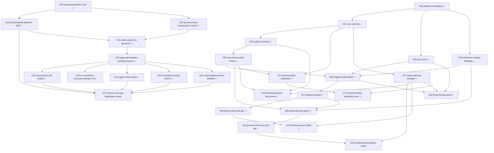

# Issue DAG

> Regenerated 2026-06-16

## Warnings

- Existing pre-merge issues `005` through `017` still reference `issues/prd.md`; new annote merge issues `018` through `028` reference `issues/prd-annote-merge.md`.

## Stats

| Metric | Count |
|--------|------:|
| Total issues | 29 |
| Done | 27 |
| Ready (AFK) | 0 |
| Ready (HITL) | 1 |
| Backlog | 0 |
| In progress | 0 |
| Review | 1 |

## Parallel lanes (ready now)

| Lane | Issues | Status |
|------|--------|--------|
| _none_ | _No AFK lanes ready_ | _At WIP limit or awaiting review_ |

## Mermaid

