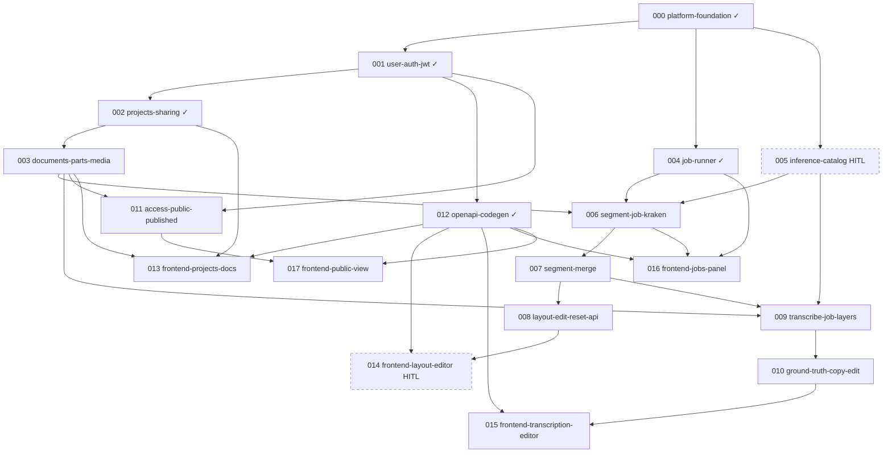

# Issue DAG

> Regenerated 2026-05-21

## Warnings

- **Frontmatter vs body drift:** several issues use `done/NNN-….md` in `blocked_by` but `issues/done/…` in `## Blocked by` — equivalent for humans; normalize if automating.

## Stats

| Metric | Count |
|--------|------:|
| Total issues | 18 |
| Done | 5 |
| Ready (AFK) | 1 |
| Ready (HITL) | 1 |
| Backlog | 11 |
| In progress | 0 |
| Review | 0 |

## Parallel lanes (ready now)

Up to **2** AFK lanes without approval (WIP in progress ≤ 4).

| Lane | Issues | Branch suggestion |
|------|--------|-------------------|
| **A** | [003-documents-parts-media](003-documents-parts-media.md) | `feat/003-documents-parts-media` |
| **B** | [005-inference-catalog-bindings](005-inference-catalog-bindings.md) (HITL — **you**) | `work/005-inference-catalog` |

After **003** + **005** complete → **006** + **011** can run in parallel.

## Mermaid

