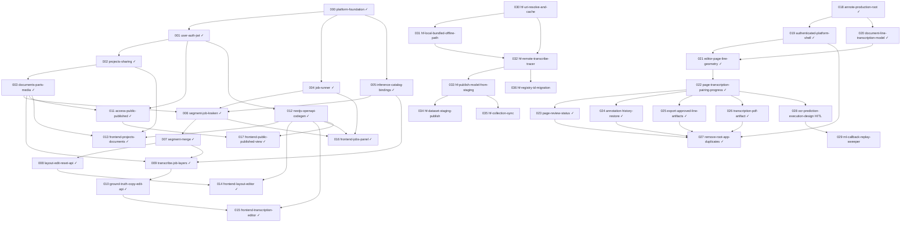

# Issue DAG

> Regenerated 2026-07-09

## Warnings

- None

## Stats

| Metric | Count |
|--------|------:|
| Total | 37 |
| Ready Afk | 0 |
| Ready Hitl | 1 |
| Blocked | 7 |
| In Progress | 0 |
| Review | 1 |
| Done | 28 |

## Parallel lanes (ready now)

- _(none)_

## Mermaid

