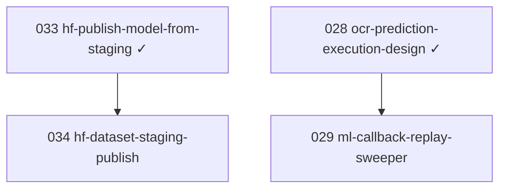

# Issue DAG

> Updated 2026-07-09 — active backlog only

## Stats

| Metric | Count |
|--------|------:|
| Backlog | 1 |
| Ready | 1 |
| In progress | 0 |
| Done (archived) | 37 |

## Parallel lanes (ready now)

- **034** hf-dataset-staging-publish

## Mermaid

Historical DAG for issues 000–041: [done/README.md](done/README.md).
