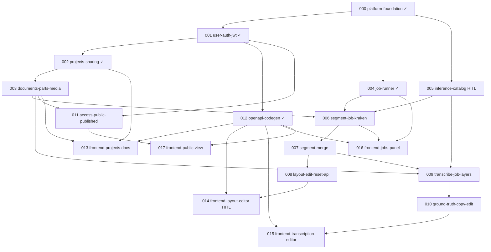

# Issue DAG

> Generated 2026-05-21 from `issues/**/*.md` frontmatter

## Mermaid

## Parallel lanes (when blockers clear)

| Lane | Issues | Notes |
|------|--------|-------|
| **Now** | 003 (AFK), 005 (HITL) | After 002/000 done |
| After 003 + 005 | 006, 011 | Segment + access policy |
| After 006 | 007, 009 | Merge + transcribe jobs |
| After 007 + 009 | 008, 010 | Layout API + ground truth API |
| After 003 + 012 | 013 | Projects/documents UI |
| After 006 + 004 + 012 | 016 | Jobs panel |
| After 011 + 012 | 017 | Public view |

## Warnings

- None — all kanban links resolve to committed issue files.
