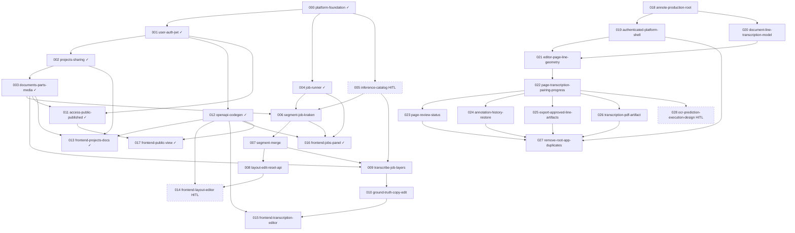

# Issue DAG

> Regenerated 2026-06-16

## Warnings

- Existing pre-merge issues `005` through `017` still reference `issues/prd.md`; new annote merge issues `018` through `028` reference `issues/prd-annote-merge.md`.
- Several older issues use `done/NNN-....md` in frontmatter and `issues/done/...` in body text; this is equivalent for humans but should be normalized before strict automation.

## Stats

| Metric | Count |
|--------|------:|
| Total issues | 29 |
| Done | 10 |
| Ready (AFK) | 0 |
| Ready (HITL) | 0 |
| Backlog | 7 |
| In progress | 0 |
| Review | 12 |

## Parallel lanes (ready now)

| Lane | Issues | Status |
|------|--------|--------|
| **A** | [018](018-annote-production-root.md) (AFK) | Review |
| **B** | [005](005-inference-catalog-bindings.md) (HITL — **you**) | Review |

## Parallel lanes (after blockers)

| Lane | Issues | Branch |
|------|--------|--------|
| **A1** | 019 → 021 → 022 → 023 | `feat/019-authenticated-platform-shell` |
| **A2** | 020 → 021 → 022 → 024 | `feat/020-document-line-transcription-model` |
| **A3** | 022 → 025 | `feat/025-export-approved-line-artifacts` |
| **A4** | 022 → 026 | `feat/026-transcription-pdf-artifact` |
| **A5** | 023 + 024 + 025 + 026 → 027 | `feat/027-remove-root-app-duplicates` |
| **H1** | 022 → 028 (HITL) | `work/028-ocr-prediction-execution-design` |
| **C** | 006 → 007 → 008 | `feat/006-segment-pipeline` |
| **E** | 009 → 010 | `feat/009-transcribe-pipeline` |
| **G** | 014 (HITL) | `work/014-frontend-layout` |
| **H** | 015 | `feat/015-frontend-transcription` |

## Mermaid

