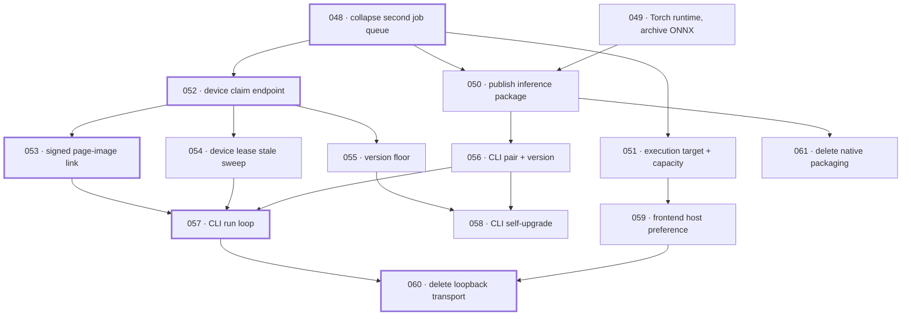

# Issue DAG

> Regenerated 2026-08-05, post-merge, for the inference redesign. Parent PRD [#47](https://github.com/kkkamur07/greekOCR/issues/47).
>
> Governed by [ADR 0002](../docs/adr/0002-inference-cli-replaces-loopback-helper.md) and
> [ADR 0003](../docs/adr/0003-single-job-queue-cloud-worker-claims-like-a-device.md).

## Warnings

- None. No cycles, and frontmatter `blocked_by` matched every `## Blocked by` body section.

## Parallel lanes (ready now)

None, because every wave is merged. The graph is fully consumed: 057 and 058 ran as the last
parallel pair, and 060 ran alone behind them as the terminal node.

Worth recording for the next decomposition: the lane cap of 5 was only ever the binding
constraint during wave 3. Everywhere else the *graph* was the limit, and it narrowed as the
work went on, from 5 lanes to 2 to 1. Sizing an agent pool to the widest point of a DAG buys
idle agents for most of the run.

| Wave | Issues                             | Why they can run together                                                                                                                                                                                                     |
| ---- | ---------------------------------- | ----------------------------------------------------------------------------------------------------------------------------------------------------------------------------------------------------------------------------- |
| 1    | `048`, `049`                       | No blockers. 048 is platform-side (queue deletion) and 049 is runtime-side (ONNX to Torch, per ADR 0004), so the trees are disjoint apart from `pyproject.toml`, where a small dependency-group conflict is expected and cheap to resolve. |
| 2    | `050`, `051`, `052`                | All unblocked once 048 lands; 050 also needs 049. 051 and 052 touch the same job tables, so they share a lane rather than racing.                                                                                              |
| 3    | `053`, `054`, `055`, `056`, `061`  | The widest point of the graph, at five independent slices.                                                                                                                                                                    |
| 4    | `057`, `058`                       | Both need the CLI skeleton from 056. 057 additionally needs 053 and 054; 058 needs 055.                                                                                                                                       |
| 5    | `059`                              | Needs 051. Could in principle have run in wave 3, but was kept later to follow the backend contract it renders.                                                                                                                |
| 6    | `060`                              | Terminal. Deletes loopback only once the CLI replacement (057) and the new UI (059) both work.                                                                                                                                 |

The widest independent set is 5, at wave 3, which is why `max_lanes` is set to 5.

## Critical path

```
048 → 052 → 053 → 057 → 060
```

Five deep. `048` is deliberately first: cloud inference is off, so the queue collapse is a
deletion rather than a migration, and it shrinks the surface every later slice touches.

`060` (delete loopback) is deliberately last, because nothing is removed until its
replacement is demonstrably working.

## Stats

- Total: 14. Done: 14. Ready: 0. In progress: 0. Blocked: 0.
- Follow-up issues filed by the lanes themselves, outside the original 14:
  [#62](https://github.com/kkkamur07/greekOCR/issues/62) (segmentation peak memory),
  [#63](https://github.com/kkkamur07/greekOCR/issues/63) (device-pairing event-loop collision),
  [#64](https://github.com/kkkamur07/greekOCR/issues/64) (announce target at enqueue),
  [#65](https://github.com/kkkamur07/greekOCR/issues/65) (CUDA pin),
  [#66](https://github.com/kkkamur07/greekOCR/issues/66) (rename import package before PyPI).
- All 14 slices are AFK. There is no HITL slice, because every architectural decision was
  resolved into ADR 0002, ADR 0003, and ADR 0004 before decomposition.

## Mermaid


```mermaid
flowchart TD
  048["048 · collapse second job queue"]
  049["049 · Torch runtime, archive ONNX"]
  050["050 · publish inference package"]
  051["051 · execution target + capacity"]
  052["052 · device claim endpoint"]
  053["053 · signed page-image link"]
  054["054 · device lease stale sweep"]
  055["055 · version floor"]
  056["056 · CLI pair + version"]
  057["057 · CLI run loop"]
  058["058 · CLI self-upgrade"]
  059["059 · frontend host preference"]
  060["060 · delete loopback transport"]
  061["061 · delete native packaging"]

  048 --> 050
  049 --> 050
  048 --> 051
  048 --> 052
  052 --> 053
  052 --> 054
  052 --> 055
  050 --> 056
  050 --> 061
  053 --> 057
  054 --> 057
  056 --> 057
  055 --> 058
  056 --> 058
  051 --> 059
  057 --> 060
  059 --> 060

  classDef hitl stroke-dasharray: 5 5
  classDef critical stroke-width:3px
  class 048,052,053,057,060 critical
```

## Branch plan

One branch per issue, all off `feat/inference-cli-redesign`:

```
feat/048-collapse-second-job-queue
feat/049-torch-runtime-archive-onnx
feat/050-publish-inference-package
...
```

Wave-1 lanes ran in isolated git worktrees so the two agents could not collide on the
working tree.
