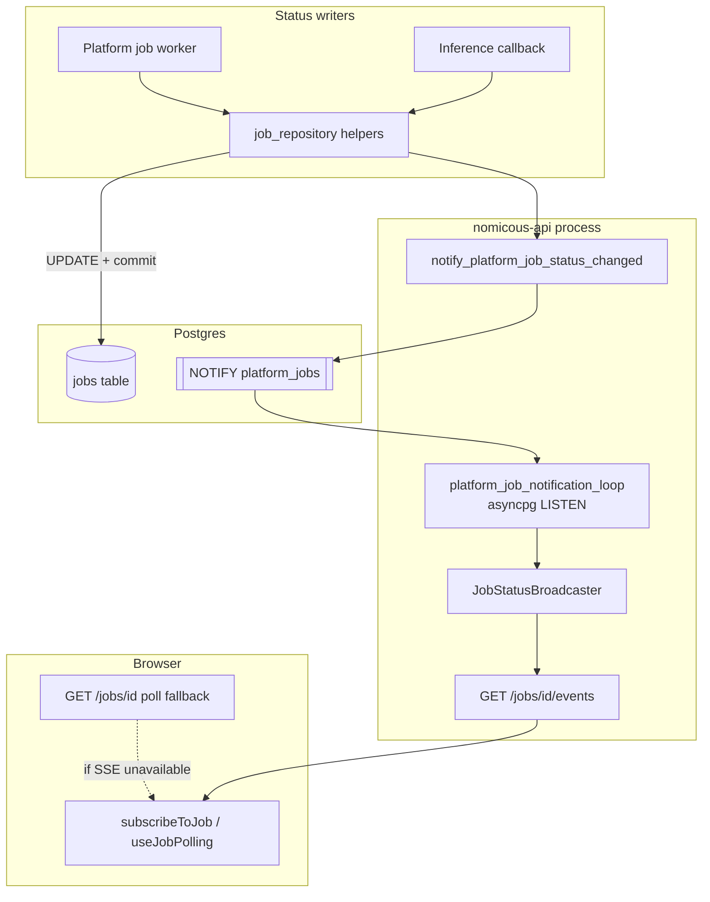
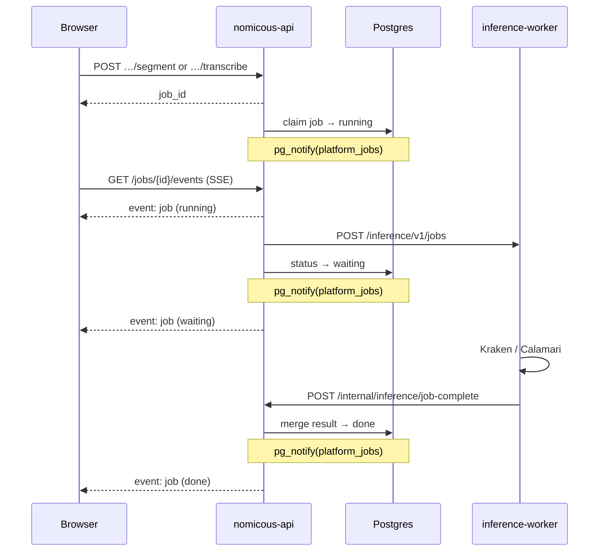
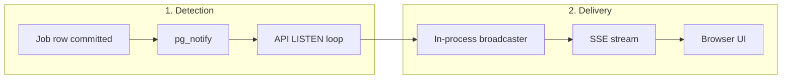

# Nomicous Backend

FastAPI backend for the production Nomicous platform. It exposes authentication,
Project, Document, Document part/Page, layout, transcription, annotation history,
Export, Transcription PDF, ML model catalog, and job APIs.

Run backend commands from the `nomicous/` app root unless a command says otherwise.

## Quick Start

```bash
cp nomicous/backend/core/.env.example nomicous/backend/core/.env
docker compose up db -d
cd nomicous
uv run --project .. --group platform alembic -c infrastructure/alembic.ini upgrade head
uv run --project .. --group platform uvicorn backend.core.app:create_app --factory --reload
```

API URLs:

- App: `http://localhost:8000`
- Health: `http://localhost:8000/health`
- OpenAPI UI: `http://localhost:8000/docs`

## Directory Map

```text
backend/
  core/                           # FastAPI composition, settings, shared errors
    app.py                        # create_app(), middleware, router wiring
    main.py                       # Uvicorn module entrypoint
    api/                          # health/root routes
    settings/                     # Pydantic settings split by concern
  users/                          # register/login/me, JWT, password hashing
  project/                        # project CRUD, sharing, membership checks
  document/                       # documents, parts, layout, transcriptions
  annotation/                     # history snapshots, export, PDF artifacts
  ml/                             # model catalog, bindings, ML adapters
  jobs/                           # enqueue, status, NOTIFY→SSE push, workers, job persistence
tests/nomicous/                   # Unit and Postgres-backed integration tests
```

## Architecture

The production backend uses a bounded-context layout:

```text
backend/<context>/
  api/                 # FastAPI routers and HTTP DTOs
  application/         # use cases and transaction orchestration
  domain/              # domain rules that do not need infrastructure
  infrastructure/      # SQLAlchemy ORM models and repositories/adapters
```

Important rules:

- `backend/core/app.py` wires routers; route behavior lives in context routers.
- Application services enforce access checks before touching context data.
- ORM metadata is aggregated in `infrastructure/models.py` for Alembic.
- FastAPI DTOs live beside routers in `api/schemas.py`.
- Tests should prefer public API behavior through `TestClient`.

## Contexts

| Context | Main responsibilities | Key files |
|---------|-----------------------|-----------|
| `users` | Registration, login, JWT auth, current-user dependency | `users/api/auth.py`, `users/application/auth_service.py` |
| `project` | Project CRUD, owner/shared-user membership | `project/api/projects.py`, `project/domain/access.py` |
| `document` | Documents, Document parts, media, layout Blocks/Lines, Transcriptions, Pairing progress | `document/api/documents.py`, `document/application/document_service.py` |
| `annotation` | Annotation history, Export artifacts, Transcription PDF artifacts | `annotation/api/history.py`, `annotation/application/export_service.py`, `annotation/application/transcription_pdf_service.py` |
| `ml` | ML model catalog, model bindings, ML service client, canonical model outputs | `ml/api/models.py`, `ml/application/model_service.py`, `ml/infrastructure/ml_client.py` |
| `jobs` | Async job enqueueing, status reads (`GET /jobs/{id}`), SSE push (`GET /jobs/{id}/events`), claiming, worker execution, failure persistence | `jobs/api/jobs.py`, `jobs/application/job_service.py`, `jobs/infrastructure/notifications.py`, `jobs/infrastructure/worker.py` |

## Job status notifications

Platform jobs (segment, transcribe, test noop) push status updates to the browser
with **Postgres `NOTIFY` for detection** and **Server-Sent Events (SSE) for
delivery**. Polling (`GET /jobs/{id}`) remains as a fallback when SSE is
unavailable (e.g. Vercel with `JOB_SSE_NOTIFICATIONS_ENABLED=false`).

Overview in the [root README](../../README.md#job-status-sse-not-polling).

### End-to-end flow



**Segment / transcribe job (happy path):**



**Detection vs delivery** (two separate layers):



1. **Emit** - After a committed `jobs` status change, code calls
   `notify_platform_job_status_changed()` (`jobs/infrastructure/notifications.py`),
   which runs `SELECT pg_notify(:channel, :payload)` on a sync session.
2. **Listen** - The FastAPI lifespan starts `platform_job_notification_loop()` in
   `backend/core/app.py`. It opens a dedicated **asyncpg** connection (using
   `SYNC_DATABASE_URL`, not the SQLAlchemy `postgresql+asyncpg://` URL) and
   `LISTEN`s on `PLATFORM_JOB_NOTIFY_CHANNEL` (default `platform_jobs`).
3. **Fan-out** - Each notification is parsed and passed to
   `job_status_broadcaster`, an in-memory registry of per-job `asyncio.Queue`s
   owned by active SSE handlers in that API process.
4. **Deliver** - `GET /jobs/{job_id}/events` (`jobs/api/jobs.py`) subscribes the
   client queue, sends the current `JobResponse` snapshot immediately, then
   streams further `job` events when the broadcaster receives NOTIFY payloads.
   Heartbeat comments (`: heartbeat`) are sent every `JOB_SSE_HEARTBEAT_SECONDS`
   (default 45) while waiting. The stream closes after `done`, `failed`, or `cancelled`.

### When NOTIFY fires

| Trigger | Location | Typical new status |
|---------|----------|-------------------|
| Platform worker claims a job | `jobs/infrastructure/job_repository.py` → `claim_next_pending_job` | `running` |
| Job submitted to inference | `mark_job_waiting` | `waiting` |
| Job completes | `mark_job_done` | `done` |
| Job fails | `mark_job_failed` | `failed` |
| Inference callback updates product job | `jobs/application/job_callback_service.py` | `done` / `failed` |

Test noop jobs follow the same path when the in-process worker handles them.

### Frontend consumption

The React app opens `GET /jobs/{job_id}/events` through `subscribeToJob` /
`waitForSubscribedJob` (`nomicous/frontend/src/utils/jobSubscription.ts`). If
SSE cannot be opened, closes, or becomes idle, it falls back to polling
`GET /jobs/{id}`. Waiting callers poll every 250 ms; background job panels use
the `useJobPolling` hook and poll every 1.5 seconds when needed.

### Configuration

| Variable | Purpose | Default |
|----------|---------|---------|
| `PLATFORM_JOB_NOTIFY_CHANNEL` | Postgres `NOTIFY` channel name | `platform_jobs` |
| `JOB_SSE_HEARTBEAT_SECONDS` | SSE keep-alive interval while idle | `45` |
| `SYNC_DATABASE_URL` | DSN for the asyncpg notification listener | `postgresql://…` |

The notification listener must use a plain `postgresql://` DSN (`SYNC_DATABASE_URL`).
`DATABASE_URL` (`postgresql+asyncpg://…`) is for SQLAlchemy only.

### Operations

- On startup, a healthy listener logs:
  `Listening for platform job notifications on platform_jobs`.
- If the listener fails to connect, the API still serves requests; clients rely on
  poll fallback until the loop reconnects (1 s backoff between attempts).
- Each API process has its own listener and broadcaster. `NOTIFY` is
  database-global, so every replica wakes; only SSE clients connected to that
  process receive the fan-out. Sticky sessions or a single worker avoid split
  clients in multi-replica deployments.

### Tests

- `tests/nomicous/integration/test_jobs.py` - `GET /jobs/{id}/events` auth and
  snapshot streaming.

**Inference worker notifications (separate channel):** The `inference/` service uses
its own `inference_jobs` Postgres channel to wake `inference-worker`. That path
does not talk to the browser; the platform callback updates `jobs` and triggers
`platform_jobs` NOTIFY above.

## API Surface

Major route families:

- `POST /auth/register`, `POST /auth/login`, `GET /auth/me`
- `GET/POST /projects`, project update/share routes
- `GET/POST /projects/{project_id}/documents`
- `POST /projects/{project_id}/documents/{document_id}/parts`
- `GET/PUT /projects/{project_id}/documents/{document_id}/parts/{part_id}/lines`
- `PUT /.../page-transcription`, `GET /.../pairing`, `POST /.../pairings`
- `PATCH /.../transcriptions/{transcription_id}/lines/{line_id}`
- `POST/GET /.../parts/{part_id}/history`, `POST /.../history/{snapshot_id}/restore`
- `POST /.../parts/{part_id}/export`
- `POST /.../parts/{part_id}/transcription-pdf`
- `GET /inference/models`, model binding routes, `GET /jobs/{job_id}`, `GET /jobs/{job_id}/events`
- Public read-only routes under `/public/...`

After API changes, regenerate frontend contracts:

```bash
# from repository root
python scripts/platform/export_openapi.py
cd nomicous/frontend
npm run codegen:api
```

## Settings

Settings are loaded by `backend/core/settings/` from environment variables and
`backend/core/.env`.

| Variable | Purpose | Local default |
|----------|---------|---------------|
| `DATABASE_URL` | Async SQLAlchemy app connection | Set in ignored `backend/core/.env` |
| `SYNC_DATABASE_URL` | Alembic sync connection | Set in ignored `backend/core/.env` |
| `JWT_SECRET` | JWT signing secret | required; use a unique value per environment |
| `JWT_EXPIRE_MINUTES` | Access-token lifetime | `60` |
| `AUTH_RATE_LIMIT_REQUESTS` | Login/register attempts per window per client | `60` |
| `AUTH_RATE_LIMIT_WINDOW_SECONDS` | Login/register rate-limit window | `60` |
| `CORS_ORIGINS` | Browser origins | `http://localhost:3000,http://localhost:5173` |
| `MEDIA_ROOT` | Uploaded Document part media | `nomicous/backend/media` |
| `ENABLE_TEST_JOB_ROUTES` | Enables dev-only noop job route | `false` in `.env.example` |
| `PLATFORM_JOB_NOTIFY_CHANNEL` | Postgres channel for platform job status NOTIFY | `platform_jobs` |
| `JOB_SSE_HEARTBEAT_SECONDS` | SSE idle heartbeat interval for `/jobs/{id}/events` | `45` |
| `JOB_WORKER_ENABLED` | Start in-process platform job worker on API boot | `true` |
| `JOB_SSE_NOTIFICATIONS_ENABLED` | Start the in-process Postgres NOTIFY listener for SSE | `true` |

Keep real secrets out of git. `backend/core/.env` is local-only.
Production API hosts set both worker flags to `false`; run
`backend.jobs.worker_main` as a separate persistent process. If
`BEHIND_PROXY=true`, `FORWARDED_ALLOW_IPS` must contain explicit proxy IPs or
CIDRs-never `*`.

## Persistence and Media

Structured platform data is in Postgres. Uploaded page images are stored on disk
under `MEDIA_ROOT` and referenced by `document_parts.image_key`.

The repository-level `model/` workspace is intentionally outside `nomicous/`.
Inference model rows store artifact references; they do not copy weights into
the production app.

## Tests

Focused platform test examples:

```bash
uv run --group platform --group inference pytest tests/nomicous/integration/test_auth.py -q
uv run --group platform --group inference pytest tests/nomicous/integration/test_documents.py -q
uv run --group platform --group inference pytest tests/nomicous/integration/test_pairing_progress.py -q
uv run --group platform --group inference pytest tests/nomicous/integration/test_annotation_history.py -q
uv run --group platform --group inference pytest tests/nomicous/integration/test_export_approved_line_artifacts.py -q
uv run --group platform --group inference pytest tests/nomicous/integration/test_transcription_pdf_artifact.py -q
```

Run the full platform suite:

```bash
uv run --group platform --group inference pytest tests/nomicous
```

Platform tests live under `tests/nomicous/`; integration tests exercise the
platform FastAPI app.

## ML inference service

Segment and transcribe jobs call the repository-level **`inference/` service** through `InferenceClient` (`backend/ml/infrastructure/ml_client.py`).

Compose sets `INFERENCE_URL=http://inference-api:8001` on the API container. The standalone service (health, sync `/inference/v1/run`, async job submission, contracts, registry - see [`inference/README.md`](../../inference/README.md)) runs as `inference-api` + `inference-worker`.

## Special Notes

- The production platform is `backend/core` plus bounded contexts.
- Job workers and the Postgres notification listener are started by the FastAPI
  lifespan in `backend/core/app.py` (see **Job status notifications** above).
- `Page transcription` candidate Text lines are helpers; Ground truth lives in
  `line_transcriptions` under a `ground_truth` Transcription layer.
- `Review status` is a boolean on `document_parts`, independent from Pairing
  progress.
- `Annotation history` stores compact JSON snapshots, not raw edit events or
  image/export bytes.
